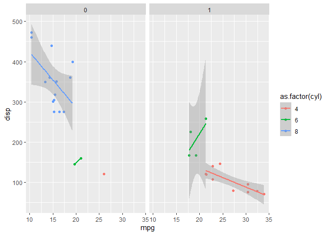

<!-------------------------------------------------->

------------------------------------------------------------------------

# Prefácio

Esta apostila está estruturada considerando quatro etapas: 1) a
apresentação do ambiente R, 2) a sua linguagem de programação,
considerando aspectos estruturais da linguagem, 3) a apresentação do R
com foco na rotina de análise da Ciência de Dados, e por fim 4) Tópicos
extras para investigações intermediárias/avançadas.

> Como complemento a este material, acesse os slides neste link:
> <https://bit.ly/intro_linguagemR_slides>.

<!-------------------------------------------------->

------------------------------------------------------------------------

# O Ambiente R

## O que é e por que usar?

O R é uma linguagem de programação interpretada, além de um ambiente de
software gratuito. Criado em 1995, no departamento de Estatística da
Universidade de Auckland - Nova Zelândia, por Ross Ihaka e Robert
Gentleman. Foi batizado como "R", tanto pelo nome de seus criadores,
quanto para fazer uma provocação à linguagem S, visto ser uma
implementação desta.

O ambiente R é disponibilizado em diferentes tipos de plataformas,
oferecendo um vasto leque de funcionalidades, bases de dados, e
integrações com outras linguagens de programação, tudo acessível via
bibliotecas. Tais bibliotecas podem ser instaladas ou desenvolvidas pelo
próprio usuário, neste último caso permitindo a disponibilização em
repositórios públicos para o acesso dos demais usuários. Em termos de
suporte, o R possui uma comunidade extremamente ativa, engajada no
aprimoramento direto da ferramenta, desenvolvimento de novas
bibliotecas, e suporte gratuito dos usuários, por meio de fóruns online,
encontros presenciais e materiais dos mais diferentes tipos.

O R é descrito no seu site oficial (<https://www.r-project.org/>) como
um ambiente para computação estatística e gráficos. Isto se deve a sua
larga, coerente e integrada coleção de recursos para todo o workflow da
análise de dados (leitura, limpeza, visualização, modelagem e
comunicação de dados). Tendo ainda que se trata de um ambiente muito
utilizado na academia, fazendo com que muitas metodologias novas sejam
primeiramente implementadas no R. Somando tais características à
amplitude e gratuidade da ferramenta, temos que o R atualmente é um dos
principais ambientes para trabalhar com análise de dados.

## Da Instalação ao Hello World

Para instalar o R o primeiro passo é entrar na página oficial do 'The R
Project for Statistical Computing' (<http://www.r-project.org/>), página
que incluí desde tutoriais e listas de mailing até a lista de eventos de
interesse e o mapeamento de upgrades e bugs. E na sessão Downloads,
opção CRAN, escolha o servidor do local mais próximo ao qual você se
encontra, ou vá direto para <https://cloud.r-project.org>, escolha o seu
sistema operacional (utilizaremos o Windows como referência), o
subdiretório "base", e então fazer o download da versão mais recente do
programa:

<div class="figure" style="text-align: center">

<p class="caption">R: Download.</p>
</div>

<!-- {width=5cm} -->

Click duas vezes no arquivo de instalação baixado, selecione o idioma de
sua preferência, e então você estará no Assistente de Instalação. Caso
você não seja administrador, na tela em que especifica a pasta em que o
programa será instalado, é necessário alterá-lo para um repositório
dentro do seu usuário. No mais, basta seguir o padrão de instalação do
Windows até a conclusão da instalação. Pronto! Tendo o R na sua máquina,
você pode acessa-lo via ícone na área de trabalho, busca do Windows, ou
pelo executável que se encontra na pasta em que o R foi instalado. E ao
digitar `"Hello World"` na janela "R Console" temos:

<div class="figure" style="text-align: center">

<p class="caption">R: Hello World.</p>
</div>

Via point-and-click temos opções que vão desde mudanças de diretórios
até a instalação de bibliotecas. Porém, por se tratar de um
interpretador, tais opções são limitadas, e temos poucos recursos em
termos de usabilidade. Como alternativa podemos trabalhar em Ambientes
de Desenvolvimento Integrados, ou IDEs, como são mais conhecidas
(*Integrated Development Environment*). A mais difundida no caso do R é
o **RStudio**:

### A IDE RStudio

O RStudio é de uma IDE do R, amplamente difundida dado os seus muitos
recursos, conforme poderemos vivenciar ao longo desta apostila. Para
fazer o download do RStudio entre na página oficial do RStudio
(<https://www.rstudio.com/>), na opção 'Download' RStudio, após passar
pela descrição das opções disponíveis do RStudio, você encontrará a
lista de instaladores organizados segundo os sistemas operacionais e
processadores compatíveis:

<div class="figure" style="text-align: center">

<p class="caption">RStudio: Download.</p>
</div>

Caso você tenha acesso de administrador baixe a versão correspondente ao
seu ambiente a partir da lista de *Installers for Supported Platforms*,
abra o instalador e siga as instruções, até a conclusão da instalação.
Caso não, faça o download a partir da lista *Zip/Tarballs*, e extraia os
arquivos para a pasta desejada. Entre na pasta extraída e procure o
diretório `\bin`, nele você irá encontrar um arquivo chamado rstudio,
clique duas vezes e você estará no RStudio. E, similarmente ao caso
anterior, ao digitar `"Hello World"` na janela Console, teremos:

<div class="figure" style="text-align: center">

<p class="caption">RStudio: Hello World.</p>
</div>

Para facilitar futuros acessos é recomendável fixar o programa na barra
de tarefas, criar um atalho na área de trabalho, ou o que você julgar
mais fácil para a sua utilização. Tanto o R quanto o RStudio são
atualizados com frequência, de modo que é recomendado fazer updates
regulares.

## Tour pelo RStudio

O RStudio possui uma série de recursos que facilitam a utilização do R,
uma delas é a própria interface, que apresenta algumas opções de
painéis. Os dois principais são:

-   **Console**: painel onde os comandos são executados interativamente,
    permitindo opções como autocompletar e consultas por meio da tecla
    'Tab', ou o acesso aos comandos já digitados via a tecla 'Seta para
    cima';

-   **Source**: onde são abertos os scripts do R, ou seja, onde você irá
    escrever o código, que só será enviado para o Console quando
    executado. Para abrir um script podemos ir via point-and-click 'File
    \> New File \> R Script' ou pelo atalho Ctrl+Shift+N;

<div class="figure" style="text-align: center">

<p class="caption">RStudio: Painéis.</p>
</div>

Adicionalmente temos também:

-   **Environment**: listagem dos objetos definidos ao longo da sessão;
-   **Files**: acesso às pastas e arquivos do computador;
-   **Help**: menu de ajuda e visualização das documentações
    consultadas;
-   **History**: consulta do histórico de comandos;
-   **Packages**: gerenciamento das bibliotecas instaladas;
-   **Plots**: visualização dos gráficos gerados; e
-   **Viewer**: visualização dos relatórios e aplicativos gerados.

Todos os painéis possuem uma série de funcionalidades próprias, sendo
interessante que, conforme avance na sua utilização do R, volte a
explorar tais opções. A mesma premissa vale para a barra de ferramentas
do RStudio, onde é possível encontrar desde recursos de codificação,
como indentação de linhas, até questões de Debug ou personalização da
ferramenta, via 'Tools \> Global Options':

<div class="figure" style="text-align: center">

<p class="caption">RStudio: Layout dos Painéis.</p>
</div>

<!-------------------------------------------------->

------------------------------------------------------------------------

# Programação em R (RBase)

## O R como calculadora

Para a familiarização tanto com a interface básica do R, quanto com a
sua IDE RStudio, vamos executar alguns comandos básicos no Console do R:


```r
#soma (o separador decimal no R é o ponto)
  1 + 1.5
  #> [1] 2.5
```

Note que no Console do R os textos precedidos por `#` são comentários,
enquanto que os antecedidos por `>` caracterizam resultados - neste
material os resultados serão precedidos por `#>`, visando diferencia-lo
dos comandos:

<div class="figure" style="text-align: center">

<p class="caption">RStudio: Calculadora.</p>
</div>

Seguem mais algumas operações aritméticas básicas:


```r
#subtração
  7 - 2 
  #> [1] 5
#divisão
  9 / 3  
  #> [1] 3
#multiplicação
  100 * 10 
  #> [1] 1000
#potência
  2^4    
  #> [1] 16
#resto da divisão de 10 por 3
  10 %% 3 
  #> [1] 1
#parte inteira da divisão de 10 por 3
  10 %/% 3  
  #> [1] 3
```

Em todos os casos o resultado foi precedido por `[1]`, o que faz
referência à quantidade de elementos do resultado. Voltaremos a este
ponto na seção de Vetores atômicos.

O R permite ampliar as equações mantendo a notação básica de operações
algébricas, como a aplicação hierárquica de parênteses ou de operações.
Vale ressaltar que somente os parênteses podem ser utilizados nas
expressões matemáticas, visto que as chaves `{}` e os colchetes `[]`
possuem finalidades próprias (bloco de *statements* e *subsetting* de
dados, respectivamente):


```r
#equação ok
  (2 * ( 2 * ( 2 * (4-3))))
#equação não ok
  (2 * { 2 * [ 2 * (4-3)]})
  #> Error: <text>:4:14: '[' inesperado
  #> 3: #equação não ok
  #> 4:   (2 * { 2 * [
  #>                 ^
```

Podemos também trabalhar com operadores lógicos no R, tendo como saída
`TRUE` ou `FALSE`. Note que podemos escrever dois comandos em uma única
linha utilizando o símbolo `;` entre eles:


```r
#maior/menor
  1 < 0 ; 1 > 0 
  #> [1] FALSE
  #> [1] TRUE
#menor/maior ou igual
  1 <= 1 ; 1 >= 1 
  #> [1] TRUE
  #> [1] TRUE
#igual/diferente
  1 == 1 ; 1 != 1 
  #> [1] TRUE
  #> [1] FALSE
```

Uma outra forma de executar uma expressão no R, é escrever o código no
Editor (*Source*, ou ainda *R Script*), e envia-lo para a execução no
Console por meio do atalho 'Ctrl + Enter' ou pelo botão 'Run' do
RStudio.

No caso de digitarmos um comando incompleto no Console, como `8 ==` ou
`6 +` seguidos de 'Enter', o R mostrará o símbolo `+`, o que não tem
relação com o símbolo aritmético, mas sim que o R está aguardando os
próximos comandos. Para iniciar um novo comando, desconsiderando
comandos parciais anteriores, basta pressionar a tecla 'Esc'.
Adicionalmente, no caso de comandos que o R não reconheça, ele retornará
uma mensagem de erro, mas basta digitar o comando desejado na sequência:


```r
#erro
  3 % 9
  #> Error: <text>:2:5: unexpected input
  #> 1: #erro
  #> 2:   3 % 9
  #>        ^
```

> Para resgatar algum comando já digitado no Console, você pode utilizar
> a tecla 'seta para cima'.

## Trabalhando com funções

Assim como em muitas linguagens de programação, uma função no R é de um
conjunto de instruções organizadas visando executar uma tarefa. E nesta
linguagem funções possuem um papel fundamental, visto não só há muitas
opções disponíveis via instalação de bibliotecas, mas também as funções
*built-in*, ou seja, funções já embutidas na sua instalação básica.
Considerando apenas tais funções, podemos fazer desde cálculos
aritméticos e leitura de dados, até tabelas, gráficos e modelos
estatísticos.

O nome de tais funções no R são, em geral, intuitivos, como a função
`exp()` por exemplo, que calcula o exponencial de um número:


```r
#aplicando a função exponencial ao número 1
  exp(1)
  #> [1] 2.718282
#podemos ver o código da função ao digitar a função sem os parênteses
  exp
  #> function (x)  .Primitive("exp")
```

Uma das funções mais importantes no R é a função `help()`, ou ainda `?`,
o seu operador equivalente. Pois por meio desta função temos acesso à
documentação referente ao objeto que estivermos consultando -
`help(função_desejada)` ou `?função_desejada`. Com isto temos acesso a
informações como: descrição do objeto consultado, possibilidades de
alterações, funções relacionadas, exemplos, entre outros. Consultando o
help para a função `log` por exemplo, vemos que é possível mudar a base
segundo a qual o logaritmo é computado, e como fazer isso:

<div class="figure" style="text-align: center">

<p class="caption">RStudio: Help.</p>
</div>


```r
#por default o log é calculado na base exponencial
  log(10)
  #> [1] 2.302585

#de modo que o resultado não é alterado mesmo se explicitarmos o argumento 'base'
  log(10, base = exp(1))
  #> [1] 2.302585
  
#mas podemos altera-lo para qualquer número positivo, como a base 10 por exemplo
  log(10, base = 10)
  #> [1] 1
```

<!-- add um exemplo não matemático: paste() pode ser uma boa opção -->

Note que não foi necessário especificar o nome do primeiro argumento da
função em nenhum dos casos (`log(x=10)`). Isto porque no caso de não
especificarmos os nomes dos argumentos, o R assume a lógica de posições.
Tal prática não é recomendada nos casos em que utilizamos parâmetros não
obrigatórios (como foi o caso do argumento `base`), ou para funções que
possuem muitos argumentos.

No caso de consultas que envolvam objetos com caracteres especiais, é
necessário que o texto esteja entre crases. Para consultar a
documentação do comando `?`, por exemplo, precisamos digitar `` ?`?` ``.
No R podemos também obter ajuda considerando tópicos de modo mais geral,
por meio das funções `help.search()` e `??`.

> A função `builtins()` retorna todas as funções *built-in* disponíveis
> no R.

## Criando objetos

Objetos no R são elementos que podem ser armazenados em variáveis - isto
vale para dados, funções, símbolos e até expressões. Podemos criar
objetos utilizando o sinal de `<-` ou `=`, para atribuições da direita
para a esquerda, ou `->` para atribuições da esquerda para a direita. A
recomendação é trabalhar com `<-` para atribuições de objetos, e `=`
para a especificação de parâmetros, visto as características de cada um
dos operadores. Existem ainda os operadores `<<-` e `->>`, que são
usualmente utilizados no contexto de funções, quando há o interesse em
trabalhar com objetos definidos globalmente - voltaremos neste tema no
capítulo [Criando funções](#CriandoFuncoes) - para mais detalhes
consulte o help deste operador `` ?`<<-` ``.

Objetos podem ser nomeados com letras, números, e os símbolos `.` e `_`,
desde que o nome não seja iniciado com números ou com um símbolo
imediatamente seguido por um número. Adicionalmente, o R é uma linguagem
sensível ao caso (*case sensitive*) e, portanto, diferencia letras
maiúsculas e minúsculas:


```r
#síntaxe: letras minúsculas
  objeto <- 1 #da direita para a esquerda (RECOMENDADO)
  
#síntaxe: letras minúsculas com a primeira letra maiúscula
  Objeto =  2 #da direita para a esquerda

#síntaxe: letras minúsculas, símbolo e número
  3 -> objeto_1 #da esquerda para a direita
  
```

No R existem alguns nomes reservados para representar os seguintes casos
especiais:

-   **NA** (*Not Available*): uma constante lógica utilizada para
    representar dados faltantes, porém podendo ser também definido
    qualquer um dos tipos de dados descritos na próxima seção (exceto
    *raw*). Equivalente ao `NULL` das linguagens SQL e SAS.

-   **NaN** (*Not a Number*): objeto lógico representando indefinições
    matemáticas, como log de números negativos.

-   **Inf** (Infinito): conceito matemático (positivo ou negativo).

-   **NULL**: representa a ausência de informação, utilizada como
    retorno de funções cujos valores são indefinidos.

Podemos utilizar as funções com o prefixo `is.` para testar se um objeto
é um destes valores:


```r
  is.na(NA)
  #> [1] TRUE
  is.nan(NaN)
  #> [1] TRUE
  is.infinite(Inf); is.infinite(-Inf)
  #> [1] TRUE
  #> [1] TRUE
  is.null(NA)
  #> [1] FALSE
```

Apesar da relativa similaridade entre as definições dadas, as diferenças
não só existem como também podem ser observadas na prática, como por
exemplo:


```r
#exemplos
  #NULL possui tamanho zero, diferentemente das demais:
  length(NULL)
  #> [1] 0
  length(NaN); length(NA); length(Inf)
  #> [1] 1
  #> [1] 1
  #> [1] 1
  
  #Inf vs NaN
  pi / 0 
  #> [1] Inf
  0 / 0  
  #> [1] NaN

  #NA: informação de dado faltante e do tipo de objeto 
  is.nan(as.character(NaN))
  #> [1] FALSE
  is.na(as.character(NA))
  #> [1] TRUE
  #tipos de objeto serão discutidos no próximo capítulo
```

Visto a relevância de tais objetos, estes não podem ser reescritos.
Diferentemente de outras constantes, também pré definidas:


```r
#não conseguimos redefinir
  NA <- 0
  #> Error in NA <- 0: lado esquerdo da atribuição inválida (do_set)

#enquanto que para constantes pré existentes como:
  pi #ou
  #> [1] 3.141593
  letters
  #>  [1] "a" "b" "c" "d" "e" "f" "g" "h" "i" "j" "k" "l" "m" "n" "o" "p" "q" "r" "s"
  #> [20] "t" "u" "v" "w" "x" "y" "z"
  
  pi <- 0; letters <- 1
  pi; letters
  #> [1] 0
  #> [1] 1
```

Ao criar objetos passamos a ter a informação que estes carregam salvos
na memória, e podemos chama-los a qualquer momento. Assim, sempre que o
R encontrar algum destes objetos, ele irá substituí-lo pelos valores
armazenados, inclusive aplicando em funções:

<div class="figure" style="text-align: center">

<p class="caption">RStudio: Objetos.</p>
</div>

Além de criar objetos atribuindo elementos diretamente a eles, podemos
fazer a partir de operações entre elementos, entre objetos e como
resultados de funções. Adicionalmente, para excluirmos um objeto,
podemos utilizar a função `rm(nome_do objeto)`, seguido de `gc()`, para
garantir a rápida liberação da referida memória:


```r
#atribuindo um elemento diretamente
  a <- 3; a
  #> [1] 3
#resultado de operações entre elementos
  b <- 5 + a; b
  #> [1] 8
#excluindo o objeto a
  rm(a); a
  #> Error in eval(expr, envir, enclos): objeto 'a' não encontrado
  
#operações entre outros objetos
  c <-  b * (-1); c
  #> [1] -8
#resultado da aplicação de funções
  d <- abs(c); d
  #> [1] 8
```

É possível trabalhar com objetos nomeados com sintaxes não padrão no R,
ou seja, nomes que contenham espaços ou caracteres especiais. Porém,
para tal, é necessário que o nome do objeto esteja entre aspas,
inclusive ao aplica-lo em alguma função. De modo que, sempre que
possível, é interessante que tal padrão seja evitado:


```r
#definindo o objeto com sintaxe não padrão
  `1¨ objeto c/ $int@xe que $&ria #inva!ida for@ da$ a$pa$` <- 6 

#aplicando-o em uma função (log na base 10)
  log10(`1¨ objeto c/ $int@xe que $&ria #inva!ida for@ da$ a$pa$`)
  #> [1] 0.7781513
```

Para listar todos os objetos disponíveis na sessão podemos utilizar a
função `ls()`, enquanto que para excluir algum destes objetos temos a
função `rm(nome_do_objeto)`, ou ainda para apagar todos os objetos
`rm(list=ls())`.

> Para inserir o símbolo de atribuição `<-` no RStudio podemos utilizar
> o atalho `'alt + -'`.

## Entendendo dados

Para tirar maior proveito da linguagem R é importante entender os
diferentes tipos, classes e estruturas de dados disponíveis. Para este
tema recomendo acessar os
[slides](https://bit.ly/intro_linguagemR_slides){.uri} citados no
Prefácio deste material, uma vez que o conteúdo é apresentado com mais
detalhes.

Aqui vamos primeiramente entender sobre os tipos de dados existentes no
R:

### Tipos de dados

No R existem seis tipos de dados, que basicamente indicam como os
objetos são armazenados (*low-level*):

-   **character**, textos ou strings: `"a"` ou `"isto é um teste"`

-   **numeric** (ou **double**), valores decimais: `6` ou `19.4`

-   **integer**, números naturais: `2L` ou `0L` (o `L` diz para o R
    armazenar o objeto como inteiro)

-   **logical**, valores booleanos: `TRUE` e `FALSE`

-   **complex**, números complexos: `1+4i` ou `1+3i`

-   **raw**, bytes: `0a` ou `c8`

Para verificar qual é o tipo de armazenamento de um objeto, podemos
utilizar a função `typeof()`. A função `class()` pode também ser
utilizada, porém, visto que esta trabalha com a lógica hierárquica de
classes da programação orientada a objetos, o resultado só será o mesmo
do `typeof()` quando o objeto tiver a estrutura mais básica do R -
vetores atômicos. Podemos também utilizar as funções `is.` e `as.` para
testar e converter objetos, respectivamente:


```r
#definindo um objeto
  x <- 1
#o objeto é um inteiro?
  is.integer(x)
  #> [1] FALSE
#conferindo o tipo do objeto (double e numeric são sinônimos no R)
  typeof(x) ; class(x)
  #> [1] "double"
  #> [1] "numeric"
#trasformando 'x' em um texto, e redefinindo o objeto
  x <- as.character(x)
#conferindo novamente o tipo do objeto
  class(x)
  #> [1] "character"
```

Tais definições são importantes pois algumas funções só farão sentido
para determinados tipos de dados. Por exemplo: considerando o objeto `x`
do exemplo acima, inicialmente, quando se tratava de um tipo numérico,
fazia sentido aplicarmos funções aritméticas, enquanto que para o `x`
final, armazenado como texto:


```r
#tentativa de cálculo com um objeto de texto 
  log(x)
  #> Error in log(x): non-numeric argument to mathematical function
```

Uma característica de armazenamento dos objetos no R, é que eles
respeitam a seguinte hierarquia de coerção: character \> complex \>
numeric \> integer \> logical \> raw. Ou seja, se tentarmos colocar
tipos diferentes de objetos em um mesmo vetor atômico - estrutura
discutida na próxima seção - o R irá modificar o tipo dos objetos de
modo que todos passem a pertencer à mesma classe.

Tendo que objetos complexos e raw são pouco usuais, nos limitaremos a
discutir: character, numeric, integer e logical.

### Estruturas de dados

Veremos agora como estes podem ser organizados em termos de estrutura,
bem como sua criação, consulta, classe e operações disponíveis:

#### Vetores atômicos

Vetores atômicos são a estrutura mais básica do R, visto que mesmo um
elemento escalar é considerado um vetor atômico de tamanho um.
Usualmente chamados de vetores apenas, tais objetos se caracterizam por
uma única dimensão, que guardam objetos atômicos, isto é, objetos de um
mesmo tipo.

-   **Criação** <br>

A forma mais usual para criar um vetor no R é por meio da função `c()`,
que combina os elementos nele listados:


```r
#criação de vetores com o comando `c()`
  ex_vetor_character <- c("laranja", "roxo", "verde") 
  ex_vetor_character
  #> [1] "laranja" "roxo"    "verde"
  
  ex_vetor_numerical <- c(1,2,3,4,5)
  ex_vetor_numerical
  #> [1] 1 2 3 4 5
  
  ex_vetor_integer <- c(1L,2L,3L,4L,5L) 
  ex_vetor_integer
  #> [1] 1 2 3 4 5
  
  ex_vetor_logical <- c(TRUE, FALSE, TRUE, TRUE, FALSE)
  ex_vetor_logical
  #> [1]  TRUE FALSE  TRUE  TRUE FALSE
```

Existem muitas outras formas de definir vetores no R, como utilizando o
operador `:`, que gera sequências, ou a função `rep()` que replica
valores, ou mesmo a combinação entre tais funções:


```r
#opções para a criação de vetores
  ex_vetor_character2 <- rep("azul", times = 5) 
  ex_vetor_numerical2 <- 1:5
  ex_vetor_integer2 <- c(1L:3L,4L,5L)
  ex_vetor_logical2 <- c(TRUE, FALSE, c(FALSE,TRUE)) 
```

-   **Consulta** <br>

Para selecionar valores de um vetor, basta indicar o índice do elemento
de interesse entre colchetes (o índice de contagem do R se inicia no 1,
e não no 0):


```r
#consultando elementos de um vetor
  ex_acesso <- c("primeiro", "segundo", "terceiro")
  ex_acesso
  #> [1] "primeiro" "segundo"  "terceiro"
  
#acessando o primeiro elemento 
  ex_acesso[1] 
  #> [1] "primeiro"
  
#acessando o último elemento
  n <- 3; ex_acesso[n]
  #> [1] "terceiro"
```

Para consultar múltiplos elementos, podemos indicar os índices de
interesse por meio de um vetor:


```r
#consultando multiplos elementos de um vetor
  #por meio da função c()
    ex_acesso[c(2,4)]
  #> [1] "segundo" NA
  #ou qualquer função que retorne os índices
    ex_acesso[1:2]
  #> [1] "primeiro" "segundo"
  #podemos inclusive fazer consultas em outras ordens
    ex_acesso[5:1]
  #> [1] NA         NA         "terceiro" "segundo"  "primeiro"
  #ou criar novos objetos a partir destes
    ex_acesso2 <- ex_acesso[c(1,3,5)]; ex_acesso2
  #> [1] "primeiro" "terceiro" NA
  #ou ainda utilizar vetores lógicos
    ex_acesso[c(rep(TRUE,3), rep(FALSE,3))]
  #> [1] "primeiro" "segundo"  "terceiro"
```

No R podemos inclusive fazer consultas a partir dos elementos que não
temos interesse:


```r
#excluindo o primeiro elemento
  ex_acesso[-1]
  #> [1] "segundo"  "terceiro"
#excluindo os três últimos elementos
  n <- 5; ex_acesso[-((n-2):n)]
  #> [1] "primeiro" "segundo"
```

Em relação ao `[1]` que precede o resultado no Console, conforme já
comentado, se trata a quantidade de elementos do resultado,
contabilizando a posição do primeiro elemento de cada linha. Como
exemplo, se chamarmos o vetor `letters`, uma das base de dados built-in
que o R disponibiliza, teremos a posição da primeira letra da segunda
linha `r` no vetor:


```r
#exemplo
  letters
  #> [1] 1
```

-   **Classe** <br>

Um vetor possui como classe o tipo dos objetos que guarda. Sendo
importante ter em mente a hierarquia de coerção comentada na seção
anterior:


```r
  ex_vetor_combinado <- c(ex_vetor_character, ex_vetor_integer)
  class(ex_vetor_combinado)
  #> [1] "character"
```

Algumas funções inclusive fazem a mudança na classe do objeto de forma
automática:


```r
#coerção da classe lógica para inteira
  class(length(ex_vetor_logical)) #`length()` retorna o tamanho do objeto
  #> [1] "integer"
#coerção da classe inteira para numérica
  class(cos(ex_vetor_integer)) #`cos()` retorna o cosseno de um número
  #> [1] "numeric"
#coerção da classe numérica para a de texto
  class(paste(ex_vetor_numerical)) #`paste()` concatena objetos
  #> [1] "character"
```

-   **Operações** <br>

Para fazer operações entre vetores, o R alinha os objetos, e faz o
cálculo elemento a elemento.


```r
#operação entre vetores do mesmo tamanho
  1:5 + 1:5
  #> [1]  2  4  6  8 10
  paste(1:5,"_",1:5)
  #> [1] "1 _ 1" "2 _ 2" "3 _ 3" "4 _ 4" "5 _ 5"
  #ou
  paste(1:5,1:5, sep = "_")
  #> [1] "1_1" "2_2" "3_3" "4_4" "5_5"
```

No caso dos vetores possuírem tamanhos diferentes, o R irá utilizar o
esquema de reciclagem, ou seja, o vetor menor será repetido até
completar o vetor maior:


```r
#operações entre vetores de tamanhos diferentes
  1:3 + 1
  #> [1] 2 3 4
  
#operações entre vetores de tamanhos diferentes, múltiplos
  1:3 != 1:6
  #> [1] FALSE FALSE FALSE  TRUE  TRUE  TRUE

#no caso de objetos não múltiplos o R retorna o resultado + um aviso
  1:3 == c(1:3,4)
  #> Warning in 1:3 == c(1:3, 4): comprimento do objeto maior não é múltiplo do
  #> comprimento do objeto menor
  #> [1]  TRUE  TRUE  TRUE FALSE
```

-   **Atributos** <br>

O R permite que adicionemos atributos aos objetos, o que significa
associar propriedades como: nomes, dimensões, classes, comentários,
entre outros. Tais atributos não alteram a forma como o objeto é
armazenado, mas especificam o comportamento do objeto para algumas
funções. Podemos acessar os atributos vinculados a um objeto por meio da
função `attributes()`, ou considerando funções próprias aos atributos.
No caso dos vetores, falaremos dos atributos: nomes (`names()`), tamanho
(`length()`) e classe (`class()`). O caso do tamanho e da classe, são
atributos básicos, e por isso não são vinculados à função `attributes`:


```r
#verificando classe e tamanho, atributos básicos
class(ex_vetor_integer); length(ex_vetor_integer)
  #> [1] "integer"
  #> [1] 5

#nenhum dos vetores que definimos até agora tiveram atributos vinculados
attributes(ex_vetor_integer)
  #> NULL

#adicionando o atributo nome
names(ex_vetor_integer) <- c("um", "dois", "três", "quatro", "cinco")
attributes(ex_vetor_integer)       
  #> $names
  #> [1] "um"     "dois"   "três"   "quatro" "cinco"

#permitindo o acesso diretamente por seus respectivos nomes
ex_vetor_integer["três"]
  #> três 
  #>    3
    #erro
    #ex_vetor_integer[-"três"]
    #pelo index funciona
    ex_vetor_integer[-3]
  #>     um   dois quatro  cinco 
  #>      1      2      4      5
    #acerto
    ex_vetor_integer[names(ex_vetor_integer) != "três"]
  #>     um   dois quatro  cinco 
  #>      1      2      4      5
    ex_vetor_integer[c("um","três")]
  #>   um três 
  #>    1    3
    #quase erro
    ex_vetor_integer[names(ex_vetor_integer) != c("um","três")]
  #> Warning in names(ex_vetor_integer) != c("um", "três"): comprimento do objeto
  #> maior não é múltiplo do comprimento do objeto menor
  #>   dois   três quatro  cinco 
  #>      2      3      4      5
    #acerto
    ex_vetor_integer[!names(ex_vetor_integer) %in% c("um","três")]
  #>   dois quatro  cinco 
  #>      2      4      5
        #perceba que o `%in%` é importante pois a comparação é feita
        # avaliando cada um dos elementos à esquerda, em cada um 
        # dos elementos à direita. Enquanto que os simbolos `==` e 
        # `!=` avaliam par a par
  
#para retirar os nomes podemos redefinir o objeto com a função unname
  ex_vetor_integer <- unname(ex_vetor_integer)
  #ou
  names(ex_vetor_integer) <- NULL
  
  attributes(ex_vetor_integer)
  #> NULL
```

Por meio de tais atributos podemos construir casos especiais
importantes:

##### Fatores

Fatores são vetores atômicos que possuem um número limitado de
categorias (níveis) de modo que são armazenadas (*low-level*) como
inteiros. Na prática isto significa que podemos trabalhar com variáveis
categóricas, que possuem tratamento diferenciado em algumas análises
(como em modelos de regressão p.e.). Tais objetos podem ser armazenados
como strings ou inteiros, e possuem nomes associados, chamados níveis,
ou *levels*. Por padrão, o R armazena tais níveis em ordem alfabética:


```r
  ex_fator <- factor(LETTERS[1:5])
  ex_fator
  #> [1] A B C D E
  #> Levels: A B C D E
#os fatores são armazenados de acordo com os tipos de objetos discutidos
  typeof(ex_fator)
  #> [1] "integer"
#porém possuem uma classe própria
  class(ex_fator)
  #> [1] "factor"
#que permite o uso de funções especificas
  levels(ex_fator)
  #> [1] "A" "B" "C" "D" "E"
```

Os fatores permitem que seus níveis sejam ordenados, de modo que podemos
diferenciar as variáveis categóricas nominais e ordinais, em que:

-   variáveis nominais: são variáveis que possuem categorias sem
    qualquer tipo de ordenação entre elas e, portanto, não podem ser
    submetidas a operações aritméticas. Como exemplos podemos citar:
    cores, marcas ou sexo.


```r
  var_nominal <- c(rep(0,2), rep(1, 3)); var_nominal
  #> [1] 0 0 1 1 1
  var_factor <- factor(var_nominal); var_factor
  #> [1] 0 0 1 1 1
  #> Levels: 0 1
  
#podemos checar os níveis de fator 
  levels(var_factor) 
  #> [1] "0" "1"
  
#e altera-los
  levels(var_factor)[1] <- "masculino"; levels(var_factor)[2] <- "feminino"
  
#e inclusive adicionar níveis à variável
  levels(var_factor) <- c(levels(var_factor), "prefiro não responder")
  
#e assim visualizar os resultados da varíavel, mesmo sem observações vinculadas
  table(var_factor)
  #> var_factor
  #>             masculino              feminino prefiro não responder 
  #>                     2                     3                     0
```

-   variáveis ordinais: possuem uma ordenação entre as suas categorias,
    apesar de não existir uma escala bem definida entre elas. De modo
    que podemos fazer alguns cálculos, como a obtenção do nível máximo.
    Como exemplos podemos citar: classe social, escolaridade ou
    pesquisas de opinião do tipo concordo/neutro/discordo.


```r
  var_ordinal <- factor(c(rep("baixo",2), rep("alto", 3))); var_ordinal
  #> [1] baixo baixo alto  alto  alto 
  #> Levels: alto baixo

  var_ordinal <- ordered(var_ordinal); var_ordinal
  #> [1] baixo baixo alto  alto  alto 
  #> Levels: alto < baixo
  
#podemos fazer a alteração redefinindo os níveis
  levels(var_ordinal) <- c("baixo", "alto"); var_ordinal
  #> [1] alto  alto  baixo baixo baixo
  #> Levels: baixo < alto
```

Visto ser um caso particular dos vetores a forma de acesso é a mesma. No
mais podemos utilizar funções como: `is.factor`/`is.ordered` e
`as.factor`/`as.ordered`.

##### Datas

O R possui uma classe própria para objetos que armazenam datas. De modo
que para transformar um elemento para tal classe podemos utilizar a
função `as.Date()`:


```r
  ex_date <- as.Date(c("1988-03-25", "2019-03-25"))
  typeof(ex_date)
  #> [1] "double"
  class(ex_date)
  #> [1] "Date"
```

Ou ainda:


```r
  as.Date("01/12/2012", format = "%d/%m/%Y")
  #> [1] "2012-12-01"
```

Abaixo estão listadas algumas alternativas de formato - para mais opções
consulte `?strptime`:

-   %d: dias numéricos (0-31)
-   %a: dias da semana, abreviados (Mon)
-   %A: dias da semana, não abreviados (Monday)
-   %m: meses numéricos (00-12)
-   %b: meses em texto, abreviados (Jan)
-   %B: meses em texto, não abreviados (January)
-   %y: anos com dois dígitos (19)
-   %Y: anos com quatro dígitos (2019)

<!-- Tal classe representa números desde '1970-01-01', com valores negativos para os dias anteriores.  -->

Desta forma podemos fazer cálculos cabíveis à dados desta natureza,
como, por exemplo, a quantidade de dias entre duas datas:


```r
  ex_date[1] - ex_date[2]
  #> Time difference of -11322 days
```

#### Matrizes e arrays

Matrizes são estruturas que nos permitem trabalhar com dados
bidimensionais que contenham o mesmo tamanho e o mesmo tipo de dados.
Arrays são similares, porém permitindo mais que duas dimensões. Para
criar uma matriz, podemos ou atribuir o atributo dimensão a um vetor,
por meio da função `dim()`, ou reorganizar um vetor por meio de funções
específicas:


```r
  x <- 1:8

#criando uma matriz a partir da atribuição de dimensões
  dim(x) <- c(2,4); x
  #>      [,1] [,2] [,3] [,4]
  #> [1,]    1    3    5    7
  #> [2,]    2    4    6    8

#ou definindo uma matriz a partir do número de linhas
  matrix(x, nrow = 2)
  #>      [,1] [,2] [,3] [,4]
  #> [1,]    1    3    5    7
  #> [2,]    2    4    6    8
  matrix(x, nrow = 2, byrow = TRUE)
  #>      [,1] [,2] [,3] [,4]
  #> [1,]    1    2    3    4
  #> [2,]    5    6    7    8
  
#pelo número de colunas
  matrix(x, ncol = 2)
  #>      [,1] [,2]
  #> [1,]    1    5
  #> [2,]    2    6
  #> [3,]    3    7
  #> [4,]    4    8

#ou ainda, ambos
  ex_matriz <- matrix(x, 2, 4); ex_matriz
  #>      [,1] [,2] [,3] [,4]
  #> [1,]    1    3    5    7
  #> [2,]    2    4    6    8
```

No caso da criação de um array é necessário definir um vetor como
primeiro argumento, e um vetor com as dimensões como segundo:


```r
  ex_array <- array(x, dim = c(2, 2, 2)); ex_array
  #> , , 1
  #> 
  #>      [,1] [,2]
  #> [1,]    1    3
  #> [2,]    2    4
  #> 
  #> , , 2
  #> 
  #>      [,1] [,2]
  #> [1,]    5    7
  #> [2,]    6    8
```

-   **Consultas** <br>

A consulta de valores se dá de modo similar aos vetores, com a diferença
de precisarmos identificar qual a dimensão que estamos interessados,
utilizando vírgulas para separar as dimensões, especificadas em ordem
crescente:


```r
#matriz
  ex_matriz[1,1] 
  #> [1] 1
#array - consulta do valor contido no cruzamento do primeiro elemento das três dimensões
  ex_array[1,1,1]
  #> [1] 1
#array - consulta do valor contido no primeiro elemento da terceira dimensão
  ex_array[ , ,1]
  #>      [,1] [,2]
  #> [1,]    1    3
  #> [2,]    2    4
  
#podemos também consultar informações como a dimensão do objeto 
  dim(ex_array)
  #> [1] 2 2 2
```

-   **Classe** <br>

Estas estruturas possuem classes próprias:


```r
  class(ex_matriz)
  #> [1] "matrix" "array"
  class(ex_array)
  #> [1] "array"
```

-   **Operações** <br>

Em relação às operações, as matrizes e arrays funcionam similarmente aos
vetores, além de permitirem cálculos algébricos:


```r
#operações entre objetos
  rep(2,4) * ex_array
  #> , , 1
  #> 
  #>      [,1] [,2]
  #> [1,]    2    6
  #> [2,]    4    8
  #> 
  #> , , 2
  #> 
  #>      [,1] [,2]
  #> [1,]   10   14
  #> [2,]   12   16

#matriz transposta
  t(ex_matriz)     
  #>      [,1] [,2]
  #> [1,]    1    2
  #> [2,]    3    4
  #> [3,]    5    6
  #> [4,]    7    8

#multiplicação matricial
  ex_matriz %*% t(ex_matriz)
  #>      [,1] [,2]
  #> [1,]   84  100
  #> [2,]  100  120
```

#### Data frames

Data Frames são estruturas bidimensionais mais genéricas que as
matrizes, uma vez que as colunas podem conter tipos de objetos
diferentes. Tais estruturas, similares a uma tabela SQL ou uma planilha
do Excel, são usualmente o formato utilizado ao se importar dados para o
R:


```r
#é possível criar data frames a partir de objetos existentes
  idade <- c(31,30,25,40)
  classe <- factor(c("AB", "C", "C", "B"), ordered = T)
  flag <- c(TRUE,TRUE,NA,FALSE)
  ex_df <- data.frame(idade,classe,flag); ex_df
  #>   idade classe  flag
  #> 1    31     AB  TRUE
  #> 2    30      C  TRUE
  #> 3    25      C    NA
  #> 4    40      B FALSE
  
#ou diretamente, especificando, ou não, o nome das colunas
  data.frame(nome_da_coluna1 = 1:3, 4:6)
  #>   nome_da_coluna1 X4.6
  #> 1               1    4
  #> 2               2    5
  #> 3               3    6
```

-   **Consulta** <br> Com consultas similares às que vimos para as
    demais estruturas, um data.frame permite consultas especificando
    entre colchetes as linhas e colunas, respectivamente, separados por
    uma vírgula:


```r
#vetores de índice:
  ex_df[2,2]
  #> [1] C
  #> Levels: AB < B < C
  ex_df[c(2,4),]
  #>   idade classe  flag
  #> 2    30      C  TRUE
  #> 4    40      B FALSE
  ex_df[1,1:2]
  #>   idade classe
  #> 1    31     AB

#nomenclatura:
  ex_df$idade
  #> [1] 31 30 25 40
  ex_df[c("idade","classe")]
  #>   idade classe
  #> 1    31     AB
  #> 2    30      C
  #> 3    25      C
  #> 4    40      B

#vetores lógicos, e combinando as opções anteriores:
  ex_df[ex_df$idade>30,1]
  #> [1] 31 40
  ex_df[rownames(ex_df)==4,]
  #>   idade classe  flag
  #> 4    40      B FALSE
  ex_df[which(flag==TRUE),] 
  #>   idade classe flag
  #> 1    31     AB TRUE
  #> 2    30      C TRUE
```

-   **Classe** <br> Os Data Frames possuem uma classe própria, podendo
    ser consultada via `is.data.frame()` ou aderida com
    `as.data.frame()`. Porém, em ambos os casos, os elementos do
    data.frame permanecem com as suas próprias classes:


```r
  class(ex_df)
  #> [1] "data.frame"
  class(ex_df$idade)
  #> [1] "numeric"
```

-   **Operações** <br>

Aqui temos todas as opções já discutidas, tendo como restrição apenas se
o tipo de objeto é cabível:


```r
  ex_df$idade + 1
  #> [1] 32 31 26 41
  ex_df$classe == "C"
  #> [1] FALSE  TRUE  TRUE FALSE
```

#### Listas

Listas são estruturas também de uma dimensão, similarmente aos vetores,
porém permitindo que diferentes tipos de objetos sejam guardados em um
único vetor. Para a construção de listas utilizamos `list()` ao invés de
`c()` - além de termos as opções `is.list()` e `as.list()`:


```r
  list(4L, "a", TRUE)
  #> [[1]]
  #> [1] 4
  #> 
  #> [[2]]
  #> [1] "a"
  #> 
  #> [[3]]
  #> [1] TRUE
```

Listas são também conhecidas como vetores recursivos, isto porque uma
lista pode conter outras listas, de diferentes tamanhos. Tal
característica permite que sua dimensão seja ampliada, e esta possa
conter inclusive data frames:


```r
  ex_list <- list(9:1, ex_df = ex_df, TRUE)
  ex_list
  #> [[1]]
  #> [1] 9 8 7 6 5 4 3 2 1
  #> 
  #> $ex_df
  #>   idade classe  flag
  #> 1    31     AB  TRUE
  #> 2    30      C  TRUE
  #> 3    25      C    NA
  #> 4    40      B FALSE
  #> 
  #> [[3]]
  #> [1] TRUE
```

Por tais características listas são as estruturas mais genéricas no
contexto de dados.

-   **Consultas** <br>

Para consultar elementos de uma lista, podemos seguir o padrão dos
vetores usando `[`, tendo sempre listas como retorno. Ou por meio de
`[[` - ou `$` caso os elementos sejam nomeados - tendo como retorno a
classe do elemento consultado:


```r
  ex_list[1] ; class(ex_list[1])
  #> [[1]]
  #> [1] 9 8 7 6 5 4 3 2 1
  #> [1] "list"
  ex_list[[1]] ; class(ex_list[[1]])
  #> [1] 9 8 7 6 5 4 3 2 1
  #> [1] "integer"
  ex_list$ex_df ; class(ex_list$ex_df)
  #>   idade classe  flag
  #> 1    31     AB  TRUE
  #> 2    30      C  TRUE
  #> 3    25      C    NA
  #> 4    40      B FALSE
  #> [1] "data.frame"
```

Podemos também acessar os elementos de cada um dos sub-objetos, seguindo
o padrão de consultas das suas estruturas originais:


```r
  ex_list[[1]][1]
  #> [1] 9
  ex_list$ex_df[1,1]
  #> [1] 31
```

-   **Classe** <br>

Listas possuem uma classe própria e, assim como o data frame, permite
que seus elementos mantenham as suas próprias classes:


```r
  class(ex_list)
  #> [1] "list"
  class(ex_list[[1]])
  #> [1] "integer"
  class(ex_list$ex_df)
  #> [1] "data.frame"
  class(ex_list[[3]])
  #> [1] "logical"
```

-   **Operações** <br>

Listas seguem a mesma lógica dos vetores e data.frames em relação às
operações, com esquema de reciclagem e coerção:


```r
#operação entre elementos da lista
 paste(ex_list[[1]][1:4], ex_list[[3]])
  #> [1] "9 TRUE" "8 TRUE" "7 TRUE" "6 TRUE"

#operação com uma coluna específica do data frame
 ex_list$ex_df$idade + ex_list[[1]]
  #> Warning in ex_list$ex_df$idade + ex_list[[1]]: comprimento do objeto maior não
  #> é múltiplo do comprimento do objeto menor
  #> [1] 40 38 32 46 36 34 28 42 32
```

> Para tirar dúvidas sobre como consultar os diferentes tipos de objetos
> no R consulte o help `?Extract` ou `?Syntax`.

### Minha primeira análise de dados

Agora que temos familiaridade com os dados no R, vamos análisar uma base
de dados do próprio R, visando apresentar algumas das funções *built-in*
disponibilizadas para tal, bem como apresentar formas de
importar/exportar dados.

#### Análises Descritivas {#AnalisesDescritivas}

Iremos trabalhar com a base `mtcars`, uma das bases disponíveis por
default no R. Por se tratar de uma base *built-in*, apesar dela ser
normalmente retornada no console, para que ela conste como um dos
objetos no `Environment` da sessão de trabalho, o seguinte comando é
necessário: `data(mtcars)`. Para mais detalhes sobre a referida base de
dados, contulte: `?mtcars`.


```r
#base para exemplo
  mtcars
  #>                      mpg cyl  disp  hp drat    wt  qsec vs am gear carb
  #> Mazda RX4           21.0   6 160.0 110 3.90 2.620 16.46  0  1    4    4
  #> Mazda RX4 Wag       21.0   6 160.0 110 3.90 2.875 17.02  0  1    4    4
  #> Datsun 710          22.8   4 108.0  93 3.85 2.320 18.61  1  1    4    1
  #> Hornet 4 Drive      21.4   6 258.0 110 3.08 3.215 19.44  1  0    3    1
  #> Hornet Sportabout   18.7   8 360.0 175 3.15 3.440 17.02  0  0    3    2
  #> Valiant             18.1   6 225.0 105 2.76 3.460 20.22  1  0    3    1
  #> Duster 360          14.3   8 360.0 245 3.21 3.570 15.84  0  0    3    4
  #> Merc 240D           24.4   4 146.7  62 3.69 3.190 20.00  1  0    4    2
  #> Merc 230            22.8   4 140.8  95 3.92 3.150 22.90  1  0    4    2
  #> Merc 280            19.2   6 167.6 123 3.92 3.440 18.30  1  0    4    4
  #> Merc 280C           17.8   6 167.6 123 3.92 3.440 18.90  1  0    4    4
  #> Merc 450SE          16.4   8 275.8 180 3.07 4.070 17.40  0  0    3    3
  #> Merc 450SL          17.3   8 275.8 180 3.07 3.730 17.60  0  0    3    3
  #> Merc 450SLC         15.2   8 275.8 180 3.07 3.780 18.00  0  0    3    3
  #> Cadillac Fleetwood  10.4   8 472.0 205 2.93 5.250 17.98  0  0    3    4
  #> Lincoln Continental 10.4   8 460.0 215 3.00 5.424 17.82  0  0    3    4
  #> Chrysler Imperial   14.7   8 440.0 230 3.23 5.345 17.42  0  0    3    4
  #> Fiat 128            32.4   4  78.7  66 4.08 2.200 19.47  1  1    4    1
  #> Honda Civic         30.4   4  75.7  52 4.93 1.615 18.52  1  1    4    2
  #> Toyota Corolla      33.9   4  71.1  65 4.22 1.835 19.90  1  1    4    1
  #> Toyota Corona       21.5   4 120.1  97 3.70 2.465 20.01  1  0    3    1
  #> Dodge Challenger    15.5   8 318.0 150 2.76 3.520 16.87  0  0    3    2
  #> AMC Javelin         15.2   8 304.0 150 3.15 3.435 17.30  0  0    3    2
  #> Camaro Z28          13.3   8 350.0 245 3.73 3.840 15.41  0  0    3    4
  #> Pontiac Firebird    19.2   8 400.0 175 3.08 3.845 17.05  0  0    3    2
  #> Fiat X1-9           27.3   4  79.0  66 4.08 1.935 18.90  1  1    4    1
  #> Porsche 914-2       26.0   4 120.3  91 4.43 2.140 16.70  0  1    5    2
  #> Lotus Europa        30.4   4  95.1 113 3.77 1.513 16.90  1  1    5    2
  #> Ford Pantera L      15.8   8 351.0 264 4.22 3.170 14.50  0  1    5    4
  #> Ferrari Dino        19.7   6 145.0 175 3.62 2.770 15.50  0  1    5    6
  #> Maserati Bora       15.0   8 301.0 335 3.54 3.570 14.60  0  1    5    8
  #> Volvo 142E          21.4   4 121.0 109 4.11 2.780 18.60  1  1    4    2
```

O primeiro ponto é como ter uma visão geral dos dados, para tal temos
algumas opções como:

-   `head()` - que retorna as primeiras linhas da base de dados, ou
    similarmente a função `tail()` que contempla as últimas linhas:


```r
head(mtcars)
  #>                    mpg cyl disp  hp drat    wt  qsec vs am gear carb
  #> Mazda RX4         21.0   6  160 110 3.90 2.620 16.46  0  1    4    4
  #> Mazda RX4 Wag     21.0   6  160 110 3.90 2.875 17.02  0  1    4    4
  #> Datsun 710        22.8   4  108  93 3.85 2.320 18.61  1  1    4    1
  #> Hornet 4 Drive    21.4   6  258 110 3.08 3.215 19.44  1  0    3    1
  #> Hornet Sportabout 18.7   8  360 175 3.15 3.440 17.02  0  0    3    2
  #> Valiant           18.1   6  225 105 2.76 3.460 20.22  1  0    3    1
tail(mtcars)
  #>                 mpg cyl  disp  hp drat    wt qsec vs am gear carb
  #> Porsche 914-2  26.0   4 120.3  91 4.43 2.140 16.7  0  1    5    2
  #> Lotus Europa   30.4   4  95.1 113 3.77 1.513 16.9  1  1    5    2
  #> Ford Pantera L 15.8   8 351.0 264 4.22 3.170 14.5  0  1    5    4
  #> Ferrari Dino   19.7   6 145.0 175 3.62 2.770 15.5  0  1    5    6
  #> Maserati Bora  15.0   8 301.0 335 3.54 3.570 14.6  0  1    5    8
  #> Volvo 142E     21.4   4 121.0 109 4.11 2.780 18.6  1  1    4    2
```

-   `str()` - exibe a estrutura interna de um objeto, no caso da base de
    dados que estamos trabalhando p.e., temos: a estrutura dos dados
    (data.frame), o número de linhas (32 observações) e colunas (11
    variáveis), além da classe de cada uma das colunas, e uma amostra
    das primeiras observações de cada uma das colunas:


```r
  str(mtcars)
  #> 'data.frame':	32 obs. of  11 variables:
  #>  $ mpg : num  21 21 22.8 21.4 18.7 18.1 14.3 24.4 22.8 19.2 ...
  #>  $ cyl : num  6 6 4 6 8 6 8 4 4 6 ...
  #>  $ disp: num  160 160 108 258 360 ...
  #>  $ hp  : num  110 110 93 110 175 105 245 62 95 123 ...
  #>  $ drat: num  3.9 3.9 3.85 3.08 3.15 2.76 3.21 3.69 3.92 3.92 ...
  #>  $ wt  : num  2.62 2.88 2.32 3.21 3.44 ...
  #>  $ qsec: num  16.5 17 18.6 19.4 17 ...
  #>  $ vs  : num  0 0 1 1 0 1 0 1 1 1 ...
  #>  $ am  : num  1 1 1 0 0 0 0 0 0 0 ...
  #>  $ gear: num  4 4 4 3 3 3 3 4 4 4 ...
  #>  $ carb: num  4 4 1 1 2 1 4 2 2 4 ...
```

-   `summary()` - é uma função genérica usada para produzir resumos de
    resultados segundo várias funções descritivas, no caso de variáveis
    numéricas, por exemplo:


```r
#primeiras colunas
  summary(mtcars[,1:4])
  #>       mpg             cyl             disp             hp       
  #>  Min.   :10.40   Min.   :4.000   Min.   : 71.1   Min.   : 52.0  
  #>  1st Qu.:15.43   1st Qu.:4.000   1st Qu.:120.8   1st Qu.: 96.5  
  #>  Median :19.20   Median :6.000   Median :196.3   Median :123.0  
  #>  Mean   :20.09   Mean   :6.188   Mean   :230.7   Mean   :146.7  
  #>  3rd Qu.:22.80   3rd Qu.:8.000   3rd Qu.:326.0   3rd Qu.:180.0  
  #>  Max.   :33.90   Max.   :8.000   Max.   :472.0   Max.   :335.0
```

As mesmas informações obtidas oderiam ser acessadas por meio das funções
, temos estatísticas como média (`mean()`), mediana (`median()`), mínimo
(`min()`), máximo (`max()`) e quantís (`quantile()`), porém precisariam
ser aplicadas a cada uma das colunas - ou por meio de loops, que veremos
na próxima seção. No que se tivessemos outras classes de dados no
data.frame a função `summary()` retornaria outras estatísticas, no caso
a contagem das ocorrências - neste contexto a função `table()` também
seria interessante:


```r
  ex <- data.frame(var_logical = c(TRUE,TRUE,FALSE,TRUE,FALSE),
                   var_factor = factor(c("A","A","B","B","C"), ordered = TRUE))
  str(ex)
  #> 'data.frame':	5 obs. of  2 variables:
  #>  $ var_logical: logi  TRUE TRUE FALSE TRUE FALSE
  #>  $ var_factor : Ord.factor w/ 3 levels "A"<"B"<"C": 1 1 2 2 3
  summary(ex)
  #>  var_logical     var_factor
  #>  Mode :logical   A:2       
  #>  FALSE:2         B:2       
  #>  TRUE :3         C:1
  table(ex)
  #>            var_factor
  #> var_logical A B C
  #>       FALSE 0 1 1
  #>       TRUE  2 1 0
```

Para aumentar o grau de entendimento da base, podemos trabalhar com as
muitas opções gráficas que o R oferece. Como exemplo, temos a função
`boxplot()`, que permite uma leitura visual da distribuição dos dados,
como paralelo à função `summary`, ou a função `hist()`, que retorna o
histograma para uma variável pré especificada:


```r
  boxplot(mtcars)
```


```r
  hist(mtcars$qsec)
```


Lembrando que, assim como para as funções do R em geral, os gráficos
possuem várias opções de argumento, permitindo o ajuste de rótulos,
cores, títulos, etc - para mais detalhes consulte o `help()` da função
de interesse.

Outra opção interessante trata da função `plot()`, que retorna um
gráfico genérico, definido a partir da estrutura e tipo dos dados. No
caso das três primeiras colunas da base `mtcars` por exemplo, temos os
gráficos de dispersão, obtidos para todos os pares de variáveis - o que
conversa diretamente com a função `cor()` que calcula a matriz de
covariância dos dados:


```r
#considerando as 3 primeiras colunas dos dados:
  #representação gráfica
    plot(mtcars[,1:3])
```


```r
  #representação numérica
    cor(mtcars[,1:3])
  #>             mpg        cyl       disp
  #> mpg   1.0000000 -0.8521620 -0.8475514
  #> cyl  -0.8521620  1.0000000  0.9020329
  #> disp -0.8475514  0.9020329  1.0000000
```

No R é possível evoluir de análises descritivas para inferências de
forma relativamente simples. Podemos, por exemplo, aplicar testes
estatísticos (e.g. `t.test()`), modelos de regressão/supervised models
(`lm()`), análises de cluster/unsupervised (`kmeans()`) entre outras.
Contudo, tendo sempre em mente que tais técnicas possuem diferentes
opções de parâmetros, além de premissas metodológicas que, caso não
respeitadas, podem nos levar a conclusões equivocadas.

Outro aspecto importante de uma análise diz respeito a transformações
que podemos ter o interesse em fazer, como reordenar uma coluna, ou
substituir algum elemento. No caso das bases *built-in* não temos o
poder de fazer tais alterações, sendo assim podemos salvar uma base
paralela para tais alterações - não alterar os dados originais é uma
prática recomendada na análise de dados:


```r
dados_mtcars <- mtcars

#arredondando os dados para uma casa decimal
  dados_mtcars$qsec <- round(dados_mtcars$qsec,1)
#substituindo os valores pela descrição que consta no `?mtcars` da variável
  dados_mtcars$vs <- factor(dados_mtcars$vs, labels = c("V","S"))
  
#assim
  str(dados_mtcars)
  #> 'data.frame':	32 obs. of  11 variables:
  #>  $ mpg : num  21 21 22.8 21.4 18.7 18.1 14.3 24.4 22.8 19.2 ...
  #>  $ cyl : num  6 6 4 6 8 6 8 4 4 6 ...
  #>  $ disp: num  160 160 108 258 360 ...
  #>  $ hp  : num  110 110 93 110 175 105 245 62 95 123 ...
  #>  $ drat: num  3.9 3.9 3.85 3.08 3.15 2.76 3.21 3.69 3.92 3.92 ...
  #>  $ wt  : num  2.62 2.88 2.32 3.21 3.44 ...
  #>  $ qsec: num  16.5 17 18.6 19.4 17 20.2 15.8 20 22.9 18.3 ...
  #>  $ vs  : Factor w/ 2 levels "V","S": 1 1 2 2 1 2 1 2 2 2 ...
  #>  $ am  : num  1 1 1 0 0 0 0 0 0 0 ...
  #>  $ gear: num  4 4 4 3 3 3 3 4 4 4 ...
  #>  $ carb: num  4 4 1 1 2 1 4 2 2 4 ...
```

> Para consultar as bases de dados disponibilizadas por default pelo R,
> e pelas bibliotecas carregadas na sessão corrente: `data()`. Para
> consultar as princípais funções estatísticas/machile learning
> disponíveis por default: `library(help = "stats")`.

## Importação/Exportação de arquivos

Visando facilitar a dinâmica, vamos primeiro exportar a base de dados
criada no último capítulo `dados_mtcars`, e então vamos importar esta
mesma base de dados novamente. Para exportar os dados precisamos
especificar o nome e a extensão que o arquivo será salvo, por exemplo:


```r
write.table(dados_mtcars, file = "dados_mtcars.txt")
```

Uma pergunta natural seria: onde o arquivo foi salvo? É a resposta é: no
diretório de trabalho. Para saber qual o diretório de trabalho corrente,
utilizamos o comando `getwd()` (*get working directory*), o que
retornará algo como `"C:/Users/Documents"`. Enquanto que para alterar o
diretório de trabalho temos a função `setwd()` (*set working
directory*), por meio de comandos como `setwd("C:/Users/Desktop")`.

Alternativamente podemos especificar o destino do arquivo de interesse,
de modo independente do diretório de trabalho, precedendo o nome do
arquivo com o diretório desejado, considerando o caso assim p.e.:
`write.table(dados_mtcars, file = "C:/Users/dados_mtcars.txt")` - note
que trabalhamos com barras simples (`/` ou `\\`) para especificação de
diretórios.

Para a leitura de dados seguimos o mesmo padrão, assim:


```r
  dados_lidos <- read.table("dados_mtcars.txt")
  str(dados_lidos)
  #> 'data.frame':	32 obs. of  11 variables:
  #>  $ mpg : num  21 21 22.8 21.4 18.7 18.1 14.3 24.4 22.8 19.2 ...
  #>  $ cyl : int  6 6 4 6 8 6 8 4 4 6 ...
  #>  $ disp: num  160 160 108 258 360 ...
  #>  $ hp  : int  110 110 93 110 175 105 245 62 95 123 ...
  #>  $ drat: num  3.9 3.9 3.85 3.08 3.15 2.76 3.21 3.69 3.92 3.92 ...
  #>  $ wt  : num  2.62 2.88 2.32 3.21 3.44 ...
  #>  $ qsec: num  16.5 17 18.6 19.4 17 20.2 15.8 20 22.9 18.3 ...
  #>  $ vs  : chr  "V" "V" "S" "S" ...
  #>  $ am  : int  1 1 1 0 0 0 0 0 0 0 ...
  #>  $ gear: int  4 4 4 3 3 3 3 4 4 4 ...
  #>  $ carb: int  4 4 1 1 2 1 4 2 2 4 ...
```

Tanto a função `write.table()` quanto a `read.table()`possuem uma série
de parâmetros, permitindo especificações de separadores, títulos e
comentários, e variações, permitindo trabalharmos com outras extensões.

> para consultar funções relacionadas pesquise os tópicos `??read` e
> `??write`.

## Trabalhando com bibliotecas

Bibliotecas tratam-se de uma coleção de funções, dados e códigos
compilados. A instalação destas bibliotecas, ou pacotes, como são também
chamados, é simples, podendo ser feita via point-and-click ('Tools \>
Install.Packages'), ou pelo comando
`install.packages("nome_do_pacote")`. Após a instalação é necessário
apenas carregar os pacotes desejados, por meio do comando
`library(nome_do_pacote)` - sem aspas duplas, ou ainda indo diretamente
na janela *Packages* do RStudio, e setando as bibliotecas que deseja
carregar:


```r
#instalação do pacote `ggplot2`   
install.packages("ggplot2")  

#carregando o pacote   
library(ggplot2) 
```

Tais bibliotecas se encontram disponíveis pela rede de distribuição
oficial do R, o CRAN (do inglês *Comprehensive R Archive Network*). Mas
existem também bibliotecas disponibilizadas via outros repositórios como
o Bioconductor e o GitHub, ou ainda disponíveis para download. Nestes
casos é necessário fazer a instalação com
`devtools::install_github("nome-do-repo/nome-do-pacote")`, após a
instalação do pacote `devtools`, ou, no caso de um arquivo zipado,
adicionando o parâmetro `repos = NULL`, na função `install.packages()`.


```r
#instalação do pacote a partir do CRAN   
install.packages("ggplot2") 

#instalação a partir do git (usualmente é a versão mais recente da biblioteca)   
devtools::install_github("tidyverse/ggplot2") 

#instalação a partir de um arquivo .zip salvo em "C:/Users/download/"
install.packages("C:/Users/download/ggplot2.zip", repos = NULL)
```

Um ponto importante é que uma vez que a biblioteca esteja instalada, não
é necessário carregar toda a biblioteca para utilizar uma função
especificamente, sendo suficiente utilizar o nome da biblioteca, seguido
por `::` e o nome da função desejada, ou seja:
`nome_da_biblioteta::função_de_interesse()`. Tal recurso é interessante
visto que ao fazer o load de uma biblioteca, todas as funções desta se
sobrepõem as que já estão carregadas. E como é comum que pacotes
diferentes compartilhem funções com o mesmo nome, está torna-se uma
forma de evitar tal problema - note que este recurso foi utilizado no
caso do `devtools::install_github()` do exemplo acima.

Para checar quais bibliotecas estão instaladas podemos checar a aba
`Packages` do RStudio, ou por meio do comando `installed.packages()`.
Outro ponto importante são as atualizações das bibliotecas, que pode ser
feita para todas as bibliotecas por meio do comando `update.packages()`,
ou reinstalando o pacote de interesse - para consultar quais estão
desatualizadas temos `old.packages()`. Por fim, para diferenciarmos as
funções *built-in* daquelas carregadas via bibliotecas, vamos chamar as
primeiras de funções do `R base`.

## Mais sobre a linguagem R 

### Operadores lógicos

Os operadores lógicos são usados para realizar operações lógicas, ou
seja, operações que retornam TRUE (T) ou FALSE (F)

-   **comparações básicas:** igual, maior/menor e diferente


```r
#igualdade: se os elementos à esquerda, par a par, estão contidos à direita
x == y 

#maior que
x > y 

#maior ou igual que
x >= y

#menor que
x < y 

#menor ou igual que
x <= y 

#diferente: se os elementos à esquerda, par a par, são estão contidos à direita
x != y 
```

Alguns exemplos:


```r
x <- 1
y <- 2

# x é igual a y?
x == y
  #> [1] FALSE

# x é diferente de y?
x != y
  #> [1] TRUE

# x é maior que y?
x > y
  #> [1] FALSE

# x é menor que y?
x < y
  #> [1] TRUE

# x é maior ou igual a y?
x >= y
  #> [1] FALSE

# x é menor ou igual a y?
x <= y
  #> [1] TRUE
```

-   **comparações:** `%in%`


```r
#contem: se os elementos à esquerda, um a um, estão contidos à direita
x %in% y 
```

Algumas aplicações:


```r
x <- c(1, 2, 3, 4)

# 1 está contido em x?
1 %in% x
  #> [1] TRUE

# 5 está contido em x?
5 %in% x
  #> [1] FALSE
```

Já se invertermos a comparação, passamos a fazer uso da característica
de reciclagem do R


```r
# x está contido em 1?
x %in% 1
  #> [1]  TRUE FALSE FALSE FALSE

# x está contido em 5?
x %in% 5
  #> [1] FALSE FALSE FALSE FALSE
```

Lembrando que perceba que o `%in%` é o comando recomendado para
trabalhar com vetores, pois a comparação é feita avaliando cada um dos
elementos à esquerda. De modo que todos os elementos da esquerda são
comparados, individualmente, com a lista de opções à direita. Enquanto
que o simbolo `==` trabalha com a reciclagem, e faz a avaliação em
pares, 1º elemento da esquerda com o 1º da direita, e assim por diante.


```r
x <- c(1,2,3,3) 

#1 e 3 está contido em x
c(1,3) %in% x
  #> [1] TRUE TRUE

#os elementos de x estão contidos em 1 e 3 
x %in% c(1,3)
  #> [1]  TRUE FALSE  TRUE  TRUE
 
# x está pareado com 1 e 3?
x == c(1,3)
  #> [1]  TRUE FALSE FALSE  TRUE
 
# 1 e 3 está pareado com x?
c(1,3) == x
  #> [1]  TRUE FALSE FALSE  TRUE
```

-   **negação:** `!`


```r
#negação: inverte o valor lógico de um objeto 
!x 
```

Exemplos considerando comparações de elementos:


```r
x <- TRUE
          
# negação de x
!x
  #> [1] FALSE
```

Ou comparações de mais de um elemento:


```r
x <- 1
y <- 2

# x é menor que y?
x < y
  #> [1] TRUE

# negação de x < y
!(x < y)
  #> [1] FALSE

x <- c(1, 2, 3, 4)

# 1 está contido em x?
1 %in% x
  #> [1] TRUE
!(1 %in% x)
  #> [1] FALSE
```

-   **operadores combinados:** `|` e `&`


```r
#casos mais comuns
#ou: retornando T/F para cada elemento das comparações
x | y
#e: retornando T/F para cada elemento das comparações
x & y

#casos mais específicos
#ou: retornando apenas um T/F (1ª comparação à esquerda do vetor)
x || y
#e: retornando apenas um T/F (1ª comparação à esquerda do vetor)
x && y
```

Alguns exemplos:


```r
x <- c(1, 2, 3)
y <- c(4, 5, 6)

x >= 3
  #> [1] FALSE FALSE  TRUE
x <= 5
  #> [1] TRUE TRUE TRUE

x >= 3 | x <= 5
  #> [1] TRUE TRUE TRUE
x >= 3 & x <= 5
  #> [1] FALSE FALSE  TRUE
```


```r
x <- 1
y <- 1:3

# x é igual a y ou x é maior que y?
x | y
  #> [1] TRUE TRUE TRUE

# x é igual a y ou x é menor que y?
x || y
  #> [1] TRUE
```

-   **adicionais:** \`any()\`, \`all()\` e \`identical()\`

No caso de vetores lógicos, podemos também trabalhar com as funções
`any()` e `all()`, ou ainda a função `identical()` . No caso desta
última, trata-se de uma função que precisa ser analisada com cuidado,
visto trabalhar com diferenças sutís, retornando `FALSE` para
comparações como por exemplo: `identical(1,1L)`.

### Estruturas de controle

Estruturas de controle são blocos de programação que, baseado em
parâmetros pré-definidos, definem a direção a ser seguida. No R temos
todas as funções usualmente existentes em outras linguagens.\
Vamos repassar alguns dos fluxos condicionais e de repetição mais
usuais, no caso:

-   **if** - se a declaração testada for verdade, ou seja, retornar
    `TRUE`, então os comandos especificados dentro das chaves `{}` serão
    executados:


```r
x <- 1
  if(x != 0){
    print(x+1)
  }
  #> [1] 2
```

-   **if-else** - similar ao comando `if()` porém seguido de um segundo
    bloco, que será avaliado se, e somente se, o resultado do primeiro
    bloco for `FALSE`:


```r
x <- 30
  if (x<=10) {
    print("x é menor ou igual a 10")
  } else if (x>10 & x<20) {
    print("x está entre 10 e 20")
  } else{
    print("x é maior ou igual a 20")
  }
  #> [1] "x é maior ou igual a 20"
```

Existe também `ifelse()`, uma versão mais simples, em que especificamos
ambas as ações como parametro de uma função:


```r
    x <- "olar"
    ifelse(x == "olar", "flor.do.campo", "xovens")
  #> [1] "flor.do.campo"
```

-   **for** - uma sequência de instruções que são repetidas com cada um
    dos elementos especificados:


```r
#exemplo
  x <- 1:3
  for(i in x){
    print(i)
  }
  #> [1] 1
  #> [1] 2
  #> [1] 3
```

Podemos trabalhar sem as chaves caso as instruções sejam dadas em até
uma linha após o comando `for`:


```r
#exemplo
  x <- 1:3
  for(i in x) print(i)
  #> [1] 1
  #> [1] 2
  #> [1] 3
```

-   **nested loops** - De modo similar ao anterior temos o caso dos
    loops aninhados:


```r
#exemplo ~ podemos utilizar a função `seq` para acessar os indíces de interesse
  x <- 1:2; y <- c(1,10)
  for(i in seq(x)){
    for(j in seq(y)) print(x[i]*y[j])
  }
  #> [1] 1
  #> [1] 10
  #> [1] 2
  #> [1] 20
```

-   **while** - repetição de um bloco de comandos até que certa condição
    não seja mais satisfeita:


```r
#exemplo
  i <- 1
  while (i<=6){
    print(i*i)
    i = i+1
  }
  #> [1] 1
  #> [1] 4
  #> [1] 9
  #> [1] 16
  #> [1] 25
  #> [1] 36
```

além dos comandos citados, funções como `break()`, que pode ser
utilizado para interromper um loop e dar continuidade ao fluxo do
programa, ou `next()`, que descontinua uma interação particular, e pula
para a próxima, também existem no R. Além do `repeat()`, um loop que
executa um bloco de comandos repetidamente, até que o mesmo seja
quebrado.

### Criando funções {#CriandoFuncoes}

No R podemos criar as nossas próprias funções, por meio do objeto
`function()`. Tal prática é interessante pois permite a automação de
atividades de uma forma melhor estruturada e mais consistente do que a
prática "copia e cola", além de tornar o código mais legível,
escalonável e reprodutível. Para criar tais funções existem três
aspectos que devemos considerar: o nome do objeto criado para a função
ser armazenada (que terá papel fundamental na legibilidade do código),
os argumentos que a função pode, ou não, possuir, e o corpo da função,
onde é definido o que a função faz, e o que retorna:


```r
#modelo
  nome_funcao <- function(arg_1, arg_2, ...){
     corpo da função
  }
```

Em relação ao retorno da função, o R, por default, retorna a última
linha do corpo da função. Porém, alternativamente, podemos utilizar a
função `return()`, que garante o retorno independente da posição em
relação aos demais itens do corpo da função.

Um aspecto importante de ser considerado no contexto das funções são os
seus ambientes, uma vez que estas possuem seu próprio `environment`, ou
seja, sua própria coleção de objetos (funções, variáveis, etc). De modo
que nem os cálculos realizados dentro de uma função não alteram, e não
são registrados, pelos demais ambientes. Contudo, o `environment` de uma
função consegue consultar o ambiente em que foi definida
(`parent environment`), bem como o ambiente pai deste, e assim por
diante, de forma hierárquica. Tal recurso é utilizado no contexto em que
algum objeto necessário para a execução da função não é encontrado. Como
exemplo vamos analisar a função `celcius_fahrenheit` definida abaixo, em
que para a temperatura em celsius `temp_c` a respectiva temperatura em
fahrenheit `temp_f` é calculada, porém o resultado só retornado quando
chamamos a função `celcius_fahrenheit()`, e não para o objeto `temp_f`:


```r
#exemplo
  temp_c <- 25
  
  celcius_fahrenheit <- function(){
    temp_f <- (temp_c * 9/5) + 32
    temp_f #ou, equivalentemente, return(temp_f)
  }

  temp_f
  #> Error in eval(expr, envir, enclos): objeto 'temp_f' não encontrado
  celcius_fahrenheit()
  #> [1] 77
  temp_f
  #> Error in eval(expr, envir, enclos): objeto 'temp_f' não encontrado
```

Revisitando os pontos anteriormente comentados, temos que : - como a
função não encontrou o objeto `temp_c` em seu `environment`, passou a
procura-la no ambiente em que a função foi definida, no caso, o
`Global Environment`, onde encontrou o objeto `temp_c` com o valor
`25`; - apesar da função conseguir acessar o ambiente em que foi criada,
ela não tem o poder de gravar objetos fora do seu próprio `environment`.
Sendo assim o objeto `temp_f` só "existe" dentro da funçao, e ao ser
chamado fora desta não é encontrado; e - a função ao ser chamada no
`Global Environment` retorna a sua última linha, no caso o resultado do
objeto `temp_f` - mas não o objeto em si.

O exemplo acima foi desenhado visando ilustrar como o R lida com os
diferentes ambientes, porém, em termos práticos é extremamente
desaconselhável deixar que a função dependa de parâmetros externos ao
seu próprio `environment`. Como prática aconselhável, todas as
dependências devem ser especificadas e passadas como argumentos da
função, assim:


```r
celcius_fahrenheit <- function(temp_c){
    temp_f <- (temp_c * 9/5) + 32
    temp_f
}

temp_c <- 25
celcius_fahrenheit()
  #> Error in celcius_fahrenheit(): argumento "temp_c" ausente, sem padrão
celcius_fahrenheit(temp_c)
  #> [1] 77

#ou o que faremos mais recorrentemente
temp_f <- celcius_fahrenheit(temp_c)
```

Ainda no contexto da relação de funções e seus ambientes, temos os
operadores `<<-` e `->>` como ferramentas úteis para trabalhar com a
definição de objetos em mais de um nível. De modo que primeiro o valor
do objeto será procurado na cadeia de ambientes pais, e se essa variável
for encontrada (e sua ligação não estiver bloqueada), seu valor será
redefinido, caso contrário, a atribuição ocorrerá no ambiente global.
Assim:


```r
#exemplo
  x <- 0

  myfun <- function(){
      x <<- 1
      y <<- 1
      z <- 1
      return (x+y+z)
  }
#tendo como saída:
  myfun()
  #> [1] 3
#enquanto que os objetos:
  x #foi redefinida
  #> [1] 1
  y #possou a constar no ambiente global
  #> [1] 1
  z #não existe globalmente
  #> Error in eval(expr, envir, enclos): objeto 'z' não encontrado
```

Em relação aos argumentos, assim como ocorre nas funções *built-in*,
podemos especificar valores default para os parâmetros, bem como definir
o corpo da função em uma mesma linha sem o uso de chaves, como descrito
para o `for()`:


```r
  ex_function <- function(x, y=1) x+y
  ex_function(1,0)
  #> [1] 1
  ex_function(1)
  #> [1] 2
```

Adicionalmente podemos utilizar recursos como `break()` ou `cat()` (uma
versão um pouco menos generica da função `print()`), permitindo, por
exemplo:


```r
celcius_fahrenheit <- function(temp_c){
    temp_f <- (temp_c * 9/5) + 32
    
    if(temp_c>10){ 
      cat("\n Por que 10? Porque sim! \n") 
      stop 
      }
    
    temp_f
}

celcius_fahrenheit(25)
  #> 
  #>  Por que 10? Porque sim!
  #> [1] 77
```

> Ao definir funções, podemos salva-las em outros scripts e chama-las
> por meio da função `source()`, sendo necessário especificar apenas o
> nome do script (juntamente com o diretório caso não se encontre no
> mesmo diretório).

### Tratamento de exceções

Chamamos de exceção qualquer condição anormal que possa aparecer quando
estamos executando um programa de computador. Normalmente, esses erros
acontecem por fatores externos do ponto de vista do código, como valores
ou tipos não suportados passados para uma função, necessidade de leitura
ou gravação de arquivos no sistema operacional, necessidade de conexão
com a internet para obter algum dado.

As linguagens costumam ter formas de tratar as exceções, ou seja,
métodos e funções que possam ser usados para que o programa não quebre a
execução, não apresente erros abruptos ou até mesmo continue a partir do
ponto em que o erro ocorreu. O tratamento de exceções em R é feito

utilizando a função tryCatch. A sintaxe da função é:


```r

result = tryCatch(   {     
  #Código a ser executado    
  },    warning = function(condição) {       
    #Código a ser executado caso ocorra algum aviso (warning)   
    },    error = function(condição) {       
    #Código a ser executado caso ocorra algum erro   
      },    finally={      
    # Código a sempre ser executado após um dos três blocos acima.   
        }  
  ) 
```

Por exemplo, vamos escrever um código que retorna para uma variável as
linhas de um arquivo lido de uma url:


```r
arquivo <- function(url){      
  linhas <- tryCatch({  
    message("Tentando ler o arquivo")
    readLines(con=url)
    },
    
    error=function(condicao) {
      message(paste("O caminho não pode ser acessado: ", url))
      message("Mensagem de erro original: ")
      message(condicao)
      return(NA)
    },
    
  warning=function(condicao) {
    message("Warnings foram gerados ao ler a url:")
    message(condicao)
    return(NULL)
  },
  
  finally={
    message("Fim da execução")
  })
  return(linhas) } 
```

Caso o arquivo consiga ser lido, a última linha do primeiro bloco ( o
resultado de readLines ) será retornado. Se ocorrer um erro, as
mensagens de erro são exibidas e é retornado o valor NA. Se ocorrer
algum warning, as mensagens correspondentes são enviadas e a função
retorna NULL. Independente do valor de retorno, a mensagem de fim da
execução será exibida ao final. É importante utilizar blocos de
tratamento de exceção toda vez que não houver certeza sobre as condições
necessárias para execução do código. Uma boa escolha de alternativas em
caso de erros ou problemas faz com que o programa seja executado com
maior confiabilidade, além de melhorar a legibilidade e diminuir o tempo
gasto para correção desses erros e problemas.

<!-------------------------------------------------->

------------------------------------------------------------------------

# R para Ciência de Dados (tidyverse)

Vamos agora explorar o R do ponto de vista da Ciência de Dados,
considerando um ciclo usual de *análise*, contemplando: leitura, tidy
(organização), transformações, visualizações, modelagens e comunicação,
e as possíveis repetições cabíveis.

<div class="figure" style="text-align: center">

<p class="caption">Ciclo de Análise da Ciência de Dados</p>
</div>

Note que aspectos como deploy e manutenção de modelos não estão sendo
considerados neste flow. Isto porque, apesar da incontextável
importância, tais fases tendem a priorizar aspectos como integrações com
sistemas, performance, e questões relacionadas, enquanto que para o
ciclo pontuado acima, temos o entendimento e a modelagem do problema
como meta principal.

Visando a implementação de tal ciclo no contexto da programação R iremos
trabalhar com a coleção de pacotes do `tidyverse`.

<!-- Para a apresentaçao das etapas do workflow da Ciência de Dados, vamos dar foco nas soluções do tidyverse, porém sempre comentando as soluções tradicionais via RBase - lembrando que existem dezenas de outras alternativas disponíveis, inclusive a possibilidade de desenvolvimento. -->

## O universo tidyverse

O `tidyverse` é um conjunto de bibliotecas que compartilham a mesma
gramática, contemplando todo o ciclo de análise da ciência de dados, e
tendo como base dados *tidy* - uma forma padronizada de vincular a
estrutura de um conjunto de dados (seu layout físico) com sua semântica
(seu significado). Para entendermos melhor tais características, vamos
instalar o pacote `tidyverse` e discutir a estrutura de dados, gramática
e aspectos abordados por este.


```r
install.packages("tidyverse")
```

### Dados: Tidy

Conforme comentado, dados *tidy* possuem uma estrutura padronizada
visando relacionar o layout dos dados com seu significado. Para tal
temos que, independente da origem, características, problemas e layout
dos dados, estes precisam ser organizados garantindo que:

-   cada variável tenha a sua própria coluna;
-   cada observação tenha a sua própria linha; e
-   cada valor tenha a sua própria célula.

Apesar da simplicidade das premissas, o fato do pre-requisito existir e
ser previsto no flow, garante recursos para os ajustes necessários, e
coerência para todo o ecossistema de análise.

No R tal estrutura pode ser alcançada por meio dos `data.frames`, porém
as bibliotecas do `tidyverse` trabalham com uma estrutura mais moderna,
chamada `tbl_df` ou `tibble`. Tal estrutura é proveniente da biblioteca
com o mesmo nome, porém, por ser um dos pacotes base do `tidyverse`
podemos carrega-lo utilizando qualquer uma destas bibliotecas. Visando
ilustrar esta nova estrutura, segue a reestruturação da base `mtcars`:


```r
#carregando a biblioteca `tibble`
  library(tibble)
  
  #como data.frame (estrutura original)
    class(mtcars)
  #> [1] "data.frame"
  #como tibble
    mtcars_2 <- as_tibble(mtcars)
    class(mtcars_2)
  #> [1] "tbl_df"     "tbl"        "data.frame"
  #visualização como tibble:
    mtcars_2 
  #> # A tibble: 32 × 11
  #>      mpg   cyl  disp    hp  drat    wt  qsec    vs    am  gear  carb
  #>    <dbl> <dbl> <dbl> <dbl> <dbl> <dbl> <dbl> <dbl> <dbl> <dbl> <dbl>
  #>  1  21       6  160    110  3.9   2.62  16.5     0     1     4     4
  #>  2  21       6  160    110  3.9   2.88  17.0     0     1     4     4
  #>  3  22.8     4  108     93  3.85  2.32  18.6     1     1     4     1
  #>  4  21.4     6  258    110  3.08  3.22  19.4     1     0     3     1
  #>  5  18.7     8  360    175  3.15  3.44  17.0     0     0     3     2
  #>  6  18.1     6  225    105  2.76  3.46  20.2     1     0     3     1
  #>  7  14.3     8  360    245  3.21  3.57  15.8     0     0     3     4
  #>  8  24.4     4  147.    62  3.69  3.19  20       1     0     4     2
  #>  9  22.8     4  141.    95  3.92  3.15  22.9     1     0     4     2
  #> 10  19.2     6  168.   123  3.92  3.44  18.3     1     0     4     4
  #> # ℹ 22 more rows
```

Note que a visualização que temos ao chamar os dados no formato `tibble`
é muito mais simples e descritiva que a visualização original (que pode
ser consultada na seção Análises Descritivas). Adicionalmente questões
como performance e consistência também apresentam melhorias frente aos
`data.frames`. Para criar tais estruturas podemos:


```r
#função tibble: construir a partir de colunas
  tibble(x = 1:3, y = c("a", "b", "c"))
  #> # A tibble: 3 × 2
  #>       x y    
  #>   <int> <chr>
  #> 1     1 a    
  #> 2     2 b    
  #> 3     3 c

#função tribble: ou a partir de linhas 
  tribble(~ x, ~ y,
           1, "a",
           2, "b",
           3, "c")
  #> # A tibble: 3 × 2
  #>       x y    
  #>   <dbl> <chr>
  #> 1     1 a    
  #> 2     2 b    
  #> 3     3 c
```

### Gramática: Pipe

Em relação a gramática o `tidyverse` permite que trabalhemos com a
sintaxe utilizada até então, em que a leitura de uma sequência de
operações aplicadas a um objeto é feita de dentro para fora, isto é:


```r
#leitura de dentro para fora
  funçãoN(...(função2(função1(dados))))
```

Contudo os pacotes do `tidyverse` oferecem recursos que são melhor
aproveitados quando aplicamos operações em sequência, por meio do
operador pipe `%>%`:


```r
#leitura em sequência
  dados %>% 
    função1() %>% 
    função2() %>% 
    ...
    funçãoN()
  
```

Assim, por exemplo, teremos:


```r
#exemplo
  x <- 1:5
  
  #leitura de dentro para fora
  floor(sqrt(sum(x)))
  #> [1] 3
  
  #leitura sequencial
  x %>% 
    sum %>% 
    sqrt %>% 
    floor
  #> [1] 3
```

O que além do claro ganho em termos de leitura, passamos a ter uma
análise modular, de modo que podemos alterar, remover ou inserir tais
módulos de forma simples, sem comprometer o todo:


```r
#ilustrando a facilidade em excluir uma função
  x %>% 
    #sum %>% 
    sqrt %>% 
    floor
  #> [1] 1 1 1 2 2
```

O operador `%>%` foi originalmente introduzido no R por meio da
biblioteca `magrittr`, porém ganhou tamanha importância que passou a ser
contemplado por diversos pacotes, inclusive, claro, o `tidyverse`.


```r
library(tidyverse)
```

> O operador `%>%` pode ser chamado por meio do atalho
> `'ctrl + shift + M'` no RStudio.

### O Workflow de análise

Por fim temos a questão dos pilares do workflow de análise, apresentado
no início deste capítulo, e para exemplificar como o tidyverse conversa
com este flow, segue a descrição das bibliotecas que são instaladas e
carregadas ao instalarmos e carregarmos o `tidyverse`:

-   **readr**: leitura dos dados <br></br>
-   **tibble**: opção ao data frame, otimizada <br></br>
-   **tidyr**: reformulação de layout dos dados <br></br>
-   **dplyr**: manipulação de dados <br></br>
-   **forcats**: operações com variáveis categoricas <br></br>
-   **stringr**: operações com strings <br></br>
-   **lubridate**: operações para trabalhar com datas <br></br>
-   **ggplot2**: criação de gráficos <br></br>
-   **purrr**: programação funcional <br></br>

Adicionalmente, temos que algumas bibliotecas, apesar de não serem
carregadas juntamente com os pacotes listados acima, são instaladas,
estando à disposição para uso. Aqui temos algumas delas -- para acessar
a lista completa e atualizada, acesse
<https://www.tidyverse.org/packages/> :

-   **readxl**: leitura e escrita de arquivos .xls e .xlsx <br></br>
-   **haven**: leitura e escrita de arquivos SPSS, Stata, e SAS
    <br></br>
-   **broom**: resume informações de modelagem de forma estruturada
    <br></br>
-   **knitr**: relatórios dinâmicos <br></br>

Lembrando que para utilizar as funções de tais bibliotecas é necessário
carregar o pacote individualmente. Ou, alternativamente, chamando a
função de interesse especificamente, por meio de comandos como:
`readxl::read_xlsx()` ou `lubridate::dmilliseconds()`.

Somando todas estas bibliotecas ao `Rmarkdown`, recurso que permite a
execução de códigos e relatórios automaticamente. Diminuindo
significantemente o gap existente entre a análise e a preparação do
material a ser compartilhado com os resultados obtidos/documentação. O
workflow de análise passa a ser:

<div class="figure" style="text-align: center">

<p class="caption">Ciclo de Análise da Ciência de Dados por Tidyverse</p>
</div>

> Para consultar as funções disponíveis nas principais bibliotecas do
> `tidyverse` acesse as folhas de consultas (*cheat sheets*),
> disponíveis no site oficial do RStudio.

Com todos estes pontos postos, iremos agora discutir cada um dos pilares
do ciclo de análise da Ciência de Dados.

## Importação

A etapa de importação de dados pode significar ler dados armazenados em:
arquivos de diferentes extensões, dados provenientes de outras
ferramentas, APIs da Web, e etc. Para o primeiro caso, como alternativa
ao `read.table()` do `R base`, temos a versão `readr` do `tidyverse`.
Nesta a leitura é mais rápida, com argumentos padronizados, e retornam
`tibbles` ao invés de `data frames`. Seguem alguns exemplos para a
leitura de um arquivo `"file"`, presente no diretório corrente de
trabalho, considerando diferentes opções de extensões e delimitadores:

-   `read_csv("file.csv")` - lê arquivos delimitados por vírgula
-   `read_csv2("file.csv")` - lê arquivos delimitados por ponto e
    vírgula
-   `read_delim("file.txt", delim="|")` - lê arquivos delimitados por
    tabulação (exemplo dado para o delimitador `|`)
-   `read_fwf("file.fwf", col_positions = c(1,3,5))` - lê arquivos com
    largura fixa (exemplo dado para o padrão `1,3,5`)

Em todos os casos é possível especificar características como: nome das
colunas, cabeçalho, linhas para serem puladas, ou ainda a
pré-especificação da classe de cada uma das colunas do arquivo. Contudo,
no caso deste último parâmetro não ser listado, as funções do `readr`
irão "adivinhar" a classe das colunas, retornando uma mensagem com tais
informações, conforme exemplo abaixo:


```r
read_csv(readr_example("mtcars.csv"))
  #> Rows: 32 Columns: 11
  #> ── Column specification ────────────────────────────────────────────────────────
  #> Delimiter: ","
  #> dbl (11): mpg, cyl, disp, hp, drat, wt, qsec, vs, am, gear, carb
  #> 
  #> ℹ Use `spec()` to retrieve the full column specification for this data.
  #> ℹ Specify the column types or set `show_col_types = FALSE` to quiet this message.
  #> # A tibble: 32 × 11
  #>      mpg   cyl  disp    hp  drat    wt  qsec    vs    am  gear  carb
  #>    <dbl> <dbl> <dbl> <dbl> <dbl> <dbl> <dbl> <dbl> <dbl> <dbl> <dbl>
  #>  1  21       6  160    110  3.9   2.62  16.5     0     1     4     4
  #>  2  21       6  160    110  3.9   2.88  17.0     0     1     4     4
  #>  3  22.8     4  108     93  3.85  2.32  18.6     1     1     4     1
  #>  4  21.4     6  258    110  3.08  3.22  19.4     1     0     3     1
  #>  5  18.7     8  360    175  3.15  3.44  17.0     0     0     3     2
  #>  6  18.1     6  225    105  2.76  3.46  20.2     1     0     3     1
  #>  7  14.3     8  360    245  3.21  3.57  15.8     0     0     3     4
  #>  8  24.4     4  147.    62  3.69  3.19  20       1     0     4     2
  #>  9  22.8     4  141.    95  3.92  3.15  22.9     1     0     4     2
  #> 10  19.2     6  168.   123  3.92  3.44  18.3     1     0     4     4
  #> # ℹ 22 more rows
```

Adicionalmente temos opções como os pacotes `readxl` e `haven`,
anteriormente citadas, o R dispõe de recursos como: `DBI`, `jsonlite`,
`xml2`, `httr` ou o `sparklyr`, esta última será melhor detalhada na
seção referente à Big Data.

### Diretórios e Projetos

Conforme apresentado anteriormente, para importar/exportar arquivos que
não se encontram no diretório de trabalho corrente, podemos especificar
o diretório em que o arquivo se encontra (`"diretorio/arquivo.ext"`), ou
mudar o diretório de trabalho em si (`setdw()`). Existe ainda uma
terceira alternativa: trabalhar com a opção de projetos do RStudio
(`.RProj`). Nesta, o diretório em que o arquivo `.RProj` estiver salvo,
passa a ser a pasta raiz de todas as análises. Assim todas as
especificações dos arquivos de input/output, scripts, e etc, podem ser
setados sem a necessidade de detalhar a localização exata do diretório.
Tal prática, bem como a adoção de estruturas para a organização dos
arquivos, facilitam a evolução e o compartilhamento do trabalho. Para
criar um projeto no RStudio, é necessário clicar no ícone superior à
direita, conforme a imagem abaixo:

<div class="figure" style="text-align: center">

<p class="caption">RStudio: Projeto</p>
</div>

Posteriormente, para abrir o projeto, podemos ir no mesmo ícone, no
`File/Open Project` ou ainda dando duplo click no arquivo `.Rproj`.

## Tidy

Após a importação dos dados, passamos para a etapa de tidy dos dados,
também chamada de *tidying data*. Para isto iremos primeiramente
visualizar os dados, no R existem várias funções *built-in* para isto,
como a função `names()`, que retorna o nome das colunas, ou `str()`, que
permite a visualização da estrutura de um objeto arbitrário.

Todas as funções citadas serão igualmente úteis e utilizadas no contexto
do `tidyverse`, mas, com o pacote `dplyr`, passamos a ter também a opção
`glimpse()`. Nesta, de modo similar ao `str()`, temos o número de
observações (linhas) e variáveis (colunas) dos dados, porém com a
quantidade de observações ajustadas ao display do Console.


```r
#exemplo: função `glimpse` para visualização 
  mtcars %>% glimpse()
  #> Rows: 32
  #> Columns: 11
  #> $ mpg  <dbl> 21.0, 21.0, 22.8, 21.4, 18.7, 18.1, 14.3, 24.4, 22.8, 19.2, 17.8,…
  #> $ cyl  <dbl> 6, 6, 4, 6, 8, 6, 8, 4, 4, 6, 6, 8, 8, 8, 8, 8, 8, 4, 4, 4, 4, 8,…
  #> $ disp <dbl> 160.0, 160.0, 108.0, 258.0, 360.0, 225.0, 360.0, 146.7, 140.8, 16…
  #> $ hp   <dbl> 110, 110, 93, 110, 175, 105, 245, 62, 95, 123, 123, 180, 180, 180…
  #> $ drat <dbl> 3.90, 3.90, 3.85, 3.08, 3.15, 2.76, 3.21, 3.69, 3.92, 3.92, 3.92,…
  #> $ wt   <dbl> 2.620, 2.875, 2.320, 3.215, 3.440, 3.460, 3.570, 3.190, 3.150, 3.…
  #> $ qsec <dbl> 16.46, 17.02, 18.61, 19.44, 17.02, 20.22, 15.84, 20.00, 22.90, 18…
  #> $ vs   <dbl> 0, 0, 1, 1, 0, 1, 0, 1, 1, 1, 1, 0, 0, 0, 0, 0, 0, 1, 1, 1, 1, 0,…
  #> $ am   <dbl> 1, 1, 1, 0, 0, 0, 0, 0, 0, 0, 0, 0, 0, 0, 0, 0, 0, 1, 1, 1, 0, 0,…
  #> $ gear <dbl> 4, 4, 4, 3, 3, 3, 3, 4, 4, 4, 4, 3, 3, 3, 3, 3, 3, 4, 4, 4, 3, 3,…
  #> $ carb <dbl> 4, 4, 1, 1, 2, 1, 4, 2, 2, 4, 4, 3, 3, 3, 4, 4, 4, 1, 2, 1, 1, 2,…
```

A partir da visualização começamos a fazer os ajustes necessários para
garantir que os dados estejam organizado de uma forma `tidy`, tendo como
principal ferramenta a biblioteca `tidyr`. Seguem as principais funções
deste pacote utilizando bases disponíveis pela própria biblioteca:

-   **Redimensionamento de dados**
    -   `gather()` - reorganiza os dados, combinando as colunas
        especificadas na coluna parâmetro `key`, e seus valores na
        coluna parâmetro `value`. Com tal tipo de ajuste podemos
        organizar os dados de modo a consultar várias colunas de
        interesse de uma única vez, algo útil para a aplicação de loops,
        funções e gráficos, conforme veremos na seção `Visualização`.


```r
#base para exemplo
  table4a
  #> # A tibble: 3 × 3
  #>   country     `1999` `2000`
  #>   <chr>        <dbl>  <dbl>
  #> 1 Afghanistan    745   2666
  #> 2 Brazil       37737  80488
  #> 3 China       212258 213766

#exemplo: passando as colunas para linhas
  table4a_new <- table4a %>% 
    gather(`1999`, `2000`, key = "ano", value = "valores") 
  
  table4a_new
  #> # A tibble: 6 × 3
  #>   country     ano   valores
  #>   <chr>       <chr>   <dbl>
  #> 1 Afghanistan 1999      745
  #> 2 Brazil      1999    37737
  #> 3 China       1999   212258
  #> 4 Afghanistan 2000     2666
  #> 5 Brazil      2000    80488
  #> 6 China       2000   213766
```

-   `spread()` - de maneira oposta a função anterior, aqui podemos
    expandir linhas em colunas:


```r
#exemplo: passando linhas para colunas
  table4a_new %>% 
    spread(ano, valores) 
  #> # A tibble: 3 × 3
  #>   country     `1999` `2000`
  #>   <chr>        <dbl>  <dbl>
  #> 1 Afghanistan    745   2666
  #> 2 Brazil       37737  80488
  #> 3 China       212258 213766
```

-   **Dividir/combinar células**

    -   `separate()` - divide uma única coluna em várias colunas,
        similarmente a opção `separate_rows()`, que faz a mesma coisa
        para linhas.

    
    ```r
    #base para exemplo
      table3
      #> # A tibble: 6 × 3
      #>   country      year rate             
      #>   <chr>       <dbl> <chr>            
      #> 1 Afghanistan  1999 745/19987071     
      #> 2 Afghanistan  2000 2666/20595360    
      #> 3 Brazil       1999 37737/172006362  
      #> 4 Brazil       2000 80488/174504898  
      #> 5 China        1999 212258/1272915272
      #> 6 China        2000 213766/1280428583
    
    #exemplo: dividindo colunas
      table3 %>% separate(rate, into = c("cases","pop"))
      #> # A tibble: 6 × 4
      #>   country      year cases  pop       
      #>   <chr>       <dbl> <chr>  <chr>     
      #> 1 Afghanistan  1999 745    19987071  
      #> 2 Afghanistan  2000 2666   20595360  
      #> 3 Brazil       1999 37737  172006362 
      #> 4 Brazil       2000 80488  174504898 
      #> 5 China        1999 212258 1272915272
      #> 6 China        2000 213766 1280428583
      
    #exemplo: dividindo linhas
      table3 %>% separate_rows(rate)
      #> # A tibble: 12 × 3
      #>    country      year rate      
      #>    <chr>       <dbl> <chr>     
      #>  1 Afghanistan  1999 745       
      #>  2 Afghanistan  1999 19987071  
      #>  3 Afghanistan  2000 2666      
      #>  4 Afghanistan  2000 20595360  
      #>  5 Brazil       1999 37737     
      #>  6 Brazil       1999 172006362 
      #>  7 Brazil       2000 80488     
      #>  8 Brazil       2000 174504898 
      #>  9 China        1999 212258    
      #> 10 China        1999 1272915272
      #> 11 China        2000 213766    
      #> 12 China        2000 1280428583
    ```

    -   `unite()` - e de maneira oposta as separações, temos a função
        que combina várias colunas.


```r
#base para exemplo
  table3_separate <- table3 %>% separate(rate, into = c("cases", "pop"))

#exemplo: separando a coluna rate em duas
  table3_separate %>%
    unite(cases, pop, col = "rate", sep = "/")
  #> # A tibble: 6 × 3
  #>   country      year rate             
  #>   <chr>       <dbl> <chr>            
  #> 1 Afghanistan  1999 745/19987071     
  #> 2 Afghanistan  2000 2666/20595360    
  #> 3 Brazil       1999 37737/172006362  
  #> 4 Brazil       2000 80488/174504898  
  #> 5 China        1999 212258/1272915272
  #> 6 China        2000 213766/1280428583
```

-   **Dados Faltantes**

    -   `drop_na()` - excluí todas as linhas que apresentam elementos
        faltantes.
    -   `fill()` - substituí os dados faltantes pelo valor mais recente
        da referida coluna.
    -   `replace_na()` - substituí os dados faltantes por um valor pré
        especificado.


```r
#base para exemplo
  airquality[1:5,] 
  #>   Ozone Solar.R Wind Temp Month Day
  #> 1    41     190  7.4   67     5   1
  #> 2    36     118  8.0   72     5   2
  #> 3    12     149 12.6   74     5   3
  #> 4    18     313 11.5   62     5   4
  #> 5    NA      NA 14.3   56     5   5

#exemplo: exclusão das linhas identificadas com NA
  airquality[1:5,] %>% drop_na() 
  #>   Ozone Solar.R Wind Temp Month Day
  #> 1    41     190  7.4   67     5   1
  #> 2    36     118  8.0   72     5   2
  #> 3    12     149 12.6   74     5   3
  #> 4    18     313 11.5   62     5   4
  airquality[1:5,] %>% fill(c(Ozone, Solar.R)) 
  #>   Ozone Solar.R Wind Temp Month Day
  #> 1    41     190  7.4   67     5   1
  #> 2    36     118  8.0   72     5   2
  #> 3    12     149 12.6   74     5   3
  #> 4    18     313 11.5   62     5   4
  #> 5    18     313 14.3   56     5   5
  airquality[1:5,] %>% replace_na(list(Ozone=0, Solar.R=0)) 
  #>   Ozone Solar.R Wind Temp Month Day
  #> 1    41     190  7.4   67     5   1
  #> 2    36     118  8.0   72     5   2
  #> 3    12     149 12.6   74     5   3
  #> 4    18     313 11.5   62     5   4
  #> 5     0       0 14.3   56     5   5
```

> Uma função particularmente interessante é o `View()`, pertencente ao R
> Base, que exibe os dados em uma nova janela, permitindo recursos como
> filtros e ordenação, via point-and-click.

## Manipulação

A próxima etapa no processo de análise é a manipulação da base visando
desde o entendimento de suas variáveis, considerando tabulações e
estatísticas, até a criação de novas variáveis. Para tal trabalharemos
com o pacote `dplyr`, com recursos para:

-   **Manipulação de variáveis**
    -   `select()` - seleciona variáveis, permitindo o uso de recursos
        como:
        -   `starts_with()`, `matches()`, `num_range()`, ou
            `everything()`\
    -   `mutate()` - cria/modifica variáveis
    -   `rename()` - renomeia variáveis


```r
#base exemplo
  iris[1:5,] %>% as_tibble()
  #> # A tibble: 5 × 5
  #>   Sepal.Length Sepal.Width Petal.Length Petal.Width Species
  #>          <dbl>       <dbl>        <dbl>       <dbl> <fct>  
  #> 1          5.1         3.5          1.4         0.2 setosa 
  #> 2          4.9         3            1.4         0.2 setosa 
  #> 3          4.7         3.2          1.3         0.2 setosa 
  #> 4          4.6         3.1          1.5         0.2 setosa 
  #> 5          5           3.6          1.4         0.2 setosa

#exemplo: seleção, mudança de nome, e definição de uma nova variável 
  iris[1:5,] %>% 
    as_tibble() %>% 
    select(Sepal.Length) %>% 
    rename(variavel_original = Sepal.Length) %>% 
    mutate(variavel_original_normalizada =  variavel_original %>% scale)
  #> # A tibble: 5 × 2
  #>   variavel_original variavel_original_normalizada[,1]
  #>               <dbl>                             <dbl>
  #> 1               5.1                             1.16 
  #> 2               4.9                             0.193
  #> 3               4.7                            -0.772
  #> 4               4.6                            -1.25 
  #> 5               5                               0.675
```

-   **Sumarizações**
    -   `group_by()` - manipula a base de dados segmentando por cada
        "grupo" da variável especificada e, posteriormente, combina os
        resultados, considerando os comandos seguintes dados.
    -   `summarise()` - calcula resumos de uma tabela conforme
        especificação


```r
#exemplo: calculo da quantidade de observações de cada categoria, e 
# média para a variável Petal.Length considerando a visão por Species
  iris %>% 
    group_by(Species) %>% 
    summarise(N = n(),
              PetalLength_media = mean(Petal.Length))
  #> # A tibble: 3 × 3
  #>   Species        N PetalLength_media
  #>   <fct>      <int>             <dbl>
  #> 1 setosa        50              1.46
  #> 2 versicolor    50              4.26
  #> 3 virginica     50              5.55
```

-   **Manipulação de casos**
    -   `filter()` - filtra linhas da base de dados a partir de
        critérios lógicos (retorno `TRUE`/`FALSE`)
    -   `slice()` - seleciona linhas por suas posições ordinais
    -   `top_n()` - ordena as primeiras `n` observações das colunas
        listadas
    -   `arrange()` - ordena as linhas de acordo com as colunas
        especificadas
    -   `distinct()` - remove as linhas duplicadas de uma dada entrada


```r
#exemplo: seleção segundo padrão de nomenclatura + filtro e ordenação
  iris %>% 
    select(starts_with("Petal")) %>%
    filter(Petal.Length > 6, Petal.Width > 2) %>% 
    arrange(Petal.Width)
  #>   Petal.Length Petal.Width
  #> 1          6.6         2.1
  #> 2          6.7         2.2
  #> 3          6.9         2.3
  #> 4          6.1         2.3
  #> 5          6.1         2.5

#exemplo: valor máximo de Sepal.Length para cada specie
  iris %>% 
    group_by(Species) %>% 
    top_n(1, Sepal.Length)
  #> # A tibble: 3 × 5
  #> # Groups:   Species [3]
  #>   Sepal.Length Sepal.Width Petal.Length Petal.Width Species   
  #>          <dbl>       <dbl>        <dbl>       <dbl> <fct>     
  #> 1          5.8         4            1.2         0.2 setosa    
  #> 2          7           3.2          4.7         1.4 versicolor
  #> 3          7.9         3.8          6.4         2   virginica
```

-   **Amostra**
    -   `sample_n()` - seleciona uma amostra aleatória considerando o
        número de elementos especificado
    -   `sample_frac()` - seleciona uma amostra aleatória considerando a
        proporção especificada


```r
#exemplo: amostra considerando o número de observações desejado 
# seguido de uma amostra considerando proporção
  iris %>% 
    sample_n(10) %>% 
    sample_frac(0.5) 
  #>   Sepal.Length Sepal.Width Petal.Length Petal.Width    Species
  #> 1          5.8         2.7          3.9         1.2 versicolor
  #> 2          5.2         4.1          1.5         0.1     setosa
  #> 3          6.2         2.2          4.5         1.5 versicolor
  #> 4          6.4         2.9          4.3         1.3 versicolor
  #> 5          6.1         3.0          4.9         1.8  virginica
```

-   **Combinando Bases**
    -   `inner_join()` - retorna todas as linhas da base à esquerda que
        possuem valores correspondentes na base à direita. Se houver
        várias correspondências entre xe y, todas as combinações das
        correspondências serão retornadas.
    -   `left_join()` - retorna todas as linhas de x e todas as colunas
        de x e y. Linhas em x sem correspondência em y terão valores de
        NA nas novas colunas. Se houver várias correspondências entre x
        e y, todas as combinações das correspondências serão retornadas.
    -   `full_join()` - retorna todas as linhas e todas as colunas de
        xe y. Onde não há valores correspondentes, retorna NA para o
        ausente.


```r
#bases para exemplo
  band_members %>% glimpse()
  #> Rows: 3
  #> Columns: 2
  #> $ name <chr> "Mick", "John", "Paul"
  #> $ band <chr> "Stones", "Beatles", "Beatles"
  band_instruments %>% glimpse()
  #> Rows: 3
  #> Columns: 2
  #> $ name  <chr> "John", "Paul", "Keith"
  #> $ plays <chr> "guitar", "bass", "guitar"
  band_instruments2 %>% glimpse()
  #> Rows: 3
  #> Columns: 2
  #> $ artist <chr> "John", "Paul", "Keith"
  #> $ plays  <chr> "guitar", "bass", "guitar"

#exemplo: em que as variáveis para join possuem nomes iguais
  left_join(band_members, band_instruments) %>% glimpse()
  #> Joining with `by = join_by(name)`
  #> Rows: 3
  #> Columns: 3
  #> $ name  <chr> "Mick", "John", "Paul"
  #> $ band  <chr> "Stones", "Beatles", "Beatles"
  #> $ plays <chr> NA, "guitar", "bass"

#exemplo: em que as variáveis para join possuem nomes diferentes
  left_join(band_members, band_instruments2, by = c("name"="artist")) %>%
    glimpse()
  #> Rows: 3
  #> Columns: 3
  #> $ name  <chr> "Mick", "John", "Paul"
  #> $ band  <chr> "Stones", "Beatles", "Beatles"
  #> $ plays <chr> NA, "guitar", "bass"
```

Conforme já comentado, existem bibliotecas para trabalharmos com
diferentes classes de dados. Vamos citar algumas funcionalidades dos
três pacotes com tal finalidade contidos no `tidyverse`:

-   **fatores**
    -   `fct_count()` - conta o número de valores de cada nível
    -   `fct_relevel()` - reordenar os níveis dos fatores
    -   `fct_explicit_na()` - adicionar o `NA` como um dos níveis


```r
#base para exemplo
  gss_cat %>% glimpse
  #> Rows: 21,483
  #> Columns: 9
  #> $ year    <int> 2000, 2000, 2000, 2000, 2000, 2000, 2000, 2000, 2000, 2000, 20…
  #> $ marital <fct> Never married, Divorced, Widowed, Never married, Divorced, Mar…
  #> $ age     <int> 26, 48, 67, 39, 25, 25, 36, 44, 44, 47, 53, 52, 52, 51, 52, 40…
  #> $ race    <fct> White, White, White, White, White, White, White, White, White,…
  #> $ rincome <fct> $8000 to 9999, $8000 to 9999, Not applicable, Not applicable, …
  #> $ partyid <fct> "Ind,near rep", "Not str republican", "Independent", "Ind,near…
  #> $ relig   <fct> Protestant, Protestant, Protestant, Orthodox-christian, None, …
  #> $ denom   <fct> "Southern baptist", "Baptist-dk which", "No denomination", "No…
  #> $ tvhours <int> 12, NA, 2, 4, 1, NA, 3, NA, 0, 3, 2, NA, 1, NA, 1, 7, NA, 3, 3…

#exemplo: contabilizando a quantidade de religiões declaradas 
  gss_cat$race %>% 
  fct_count() 
  #> # A tibble: 4 × 2
  #>   f                  n
  #>   <fct>          <int>
  #> 1 Other           1959
  #> 2 Black           3129
  #> 3 White          16395
  #> 4 Not applicable     0
```

-   **strings**
    -   `str_detect()` - identificar a presença de padrões em uma string
    -   `str_count()` - contabiliza o número de vezes que um padrão é
        encontrado
    -   `str_replace()` - substitui um dado padrão em uma string
    -   `str_to_lower()` - converter strings maiúsculas e minúsculas


```r
#base para exemplo
  fruit %>% 
    enframe %>% #versão tibble para vetores
    glimpse
  #> Rows: 80
  #> Columns: 2
  #> $ name  <int> 1, 2, 3, 4, 5, 6, 7, 8, 9, 10, 11, 12, 13, 14, 15, 16, 17, 18, 1…
  #> $ value <chr> "apple", "apricot", "avocado", "banana", "bell pepper", "bilberr…

#exemplo: obtenção da quantidade de palavras contendo a string "berry"
  fruit %>% 
    str_count("berry") %>% 
    sum()
  #> [1] 14
```

-   **datas**
    -   `as_date()` - converter um objeto para uma data ou hora
    -   `wday()` - retorna o dia da semana como um número decimal
    -   `today()` - retorna a data corrente
    -   `floor_date()` - arredonda para o limite inferior mais próximo
        da unidade de tempo


```r
#exemplo: retorna erro por não ser uma data válida
  birthday <- lubridate::dmy("29/02/1971")
  #> Warning: 1 failed to parse.
  
#data ok
  birthday <- lubridate::dmy("29/02/1972"); birthday
  #> [1] "1972-02-29"
  
#carregando `lubridate`, tornando o prefixo `lubridate::` desnecessário
  library(lubridate)
  
#obtenção do dia da semana da data especificada
  wday(birthday, label = TRUE)
  #> [1] ter
  #> Levels: dom < seg < ter < qua < qui < sex < sáb
```

## Visualização

A etapa de visualização possui um papel importantíssimo no contexto de
análise de dados, uma vez que, quando devidamente utilizados, nos
permitem o entendimento dos dados e suas particularidades. E, apesar da
visualização também contemplar um conjunto de medidas organizadas em
tabelas, vamos focar este capítulo na opção gráfica, visto já termos
apresentado o pacote `dplyr`, e funções de sumarização como o
`summarise()` - um pacote particularmente útil para visualizações
descritivas é o `skimr`.

Conforme apresentado no capítulo de [Análises
Descritivas](#AnalisesDescritivas), o RBase oferece uma série de opções
gráficas. Contudo, é quando começamos a trabalhar com as bibliotecas de
visualização do R, que o recurso gráfico é realmente potencializado.
Para tal temos o pacote `ggplot2` como uma das opções atualmente mais
utilizada e difundida. Nesta trabalhamos com a filosófia chamada
*Grammar of Graphics*, em que o mapeamento dos dados é feito a partir de
objetos geométricos e atributos estéticos, ambos trabalhados em uma
lógica de camadas, similarmente ao encadeamento do `Pipe` - porém
utilizando o operador `+` no lugar do `%>%`. Assim temos a estrutura:


```r
  ggplot(dados) +
    função_geometrica(mapeamentos) +
    funções_estéticas
```

em que na primeira linha inicializamos o objeto gráfico, na segunda
especificamos a representação geométrica escolhida (tipo de gráfico,
como dispersão, boxplot ou mapa p.e.), quais informações serão
utilizadas (eixos x e y p.e.) e possíveis especificações relacionados a
representação escolhida e, por fim, funções estéticas permitindo o
ajuste de: divisão de gráficos (faceting), rótulos, escalas, legendas,
sistemas de coordenadas, temas de fundo, etc.

Como um primeiro exemplo, vamos refazer o histograma da variável `qsec`,
da base `mtcars`, feita [anteriormente](#AnalisesDescritivas):


```r
  ggplot(mtcars) +
   geom_histogram(aes(qsec))
```


E agora, reestruturando a primeira linha segundo a lógica pipe,
diminuindo o intervalo de quebra do histograma (que tem 30 por default),
e alguns parâmetros estéticos:


```r
  mtcars %>% 
   ggplot() +
     geom_histogram(aes(qsec), bins = 20) + 
     labs(title = "exemplo gráfico") +
     scale_x_continuous(limits = c(15,20)) +
     theme_minimal() 
```


Visando ilustrar outras funcionalidades do `ggplot2` segue um exemplo em
que a visualização é dada em termos da variável `mpg` por `disp`,
segmentando por `vs` e modelando segundo para um dos níveis de `cyl` -
note que ambas as variáveis de segmentaçao são originalmente numéricas
e, portanto, precisam ser redefinidas como fatores, visando permitir a
leitura:


```r
#exemplo: gráfico ggplot
  mtcars %>% 
    ggplot(aes(x = mpg, y = disp, color = as.factor(cyl))) + 
    geom_point() + 
    facet_grid(~as.factor(vs)) +
    stat_smooth(method = 'lm')
  #> `geom_smooth()` using formula = 'y ~ x'
```



Adicionalmente, segue um exemplo considerando a base `diamonds`, onde o
interesse é entender a distribuição da variável `cut` em relação à
`clarity`, ou ambas quanto a `count`:


```r
#visualização dos dados
  diamonds %>% glimpse
  #> Rows: 53,940
  #> Columns: 10
  #> $ carat   <dbl> 0.23, 0.21, 0.23, 0.29, 0.31, 0.24, 0.24, 0.26, 0.22, 0.23, 0.…
  #> $ cut     <ord> Ideal, Premium, Good, Premium, Good, Very Good, Very Good, Ver…
  #> $ color   <ord> E, E, E, I, J, J, I, H, E, H, J, J, F, J, E, E, I, J, J, J, I,…
  #> $ clarity <ord> SI2, SI1, VS1, VS2, SI2, VVS2, VVS1, SI1, VS2, VS1, SI1, VS1, …
  #> $ depth   <dbl> 61.5, 59.8, 56.9, 62.4, 63.3, 62.8, 62.3, 61.9, 65.1, 59.4, 64…
  #> $ table   <dbl> 55, 61, 65, 58, 58, 57, 57, 55, 61, 61, 55, 56, 61, 54, 62, 58…
  #> $ price   <int> 326, 326, 327, 334, 335, 336, 336, 337, 337, 338, 339, 340, 34…
  #> $ x       <dbl> 3.95, 3.89, 4.05, 4.20, 4.34, 3.94, 3.95, 4.07, 3.87, 4.00, 4.…
  #> $ y       <dbl> 3.98, 3.84, 4.07, 4.23, 4.35, 3.96, 3.98, 4.11, 3.78, 4.05, 4.…
  #> $ z       <dbl> 2.43, 2.31, 2.31, 2.63, 2.75, 2.48, 2.47, 2.53, 2.49, 2.39, 2.…
```


```r
# visualização 1
  diamonds %>% 
    ggplot(aes(x = cut, fill = clarity)) + 
    geom_bar()
```


```r
# visualização 2
  diamonds %>% 
    ggplot(aes(x = cut,  y = price)) + 
    geom_bar(aes(fill = clarity), 
             stat = "identity", 
             position = "fill")
```


Por fim segue um exemplo de dados temporais em que, em conjunto com as
funções do `tidyr` e `dplyr`, remodelamos a base de dados `economics`
visando obter a visualização das variáveis `psavert` e `uempmed` desde
`1990`:


```r
economics
  #> # A tibble: 574 × 6
  #>    date         pce    pop psavert uempmed unemploy
  #>    <date>     <dbl>  <dbl>   <dbl>   <dbl>    <dbl>
  #>  1 1967-07-01  507. 198712    12.6     4.5     2944
  #>  2 1967-08-01  510. 198911    12.6     4.7     2945
  #>  3 1967-09-01  516. 199113    11.9     4.6     2958
  #>  4 1967-10-01  512. 199311    12.9     4.9     3143
  #>  5 1967-11-01  517. 199498    12.8     4.7     3066
  #>  6 1967-12-01  525. 199657    11.8     4.8     3018
  #>  7 1968-01-01  531. 199808    11.7     5.1     2878
  #>  8 1968-02-01  534. 199920    12.3     4.5     3001
  #>  9 1968-03-01  544. 200056    11.7     4.1     2877
  #> 10 1968-04-01  544  200208    12.3     4.6     2709
  #> # ℹ 564 more rows
```


```r
economics %>%
  select(date, psavert, uempmed) %>%
  filter(date>1990) %>% 
  gather(key = "variable", value = "value", -date) %>% 
  ggplot(aes(x = date, y = value)) + 
  geom_line(aes(color = variable), size = 1) +
  scale_color_manual(values = c("#00AFBB", "#E7B800")) 
  #> Warning: Using `size` aesthetic for lines was deprecated in ggplot2 3.4.0.
  #> ℹ Please use `linewidth` instead.
  #> This warning is displayed once every 8 hours.
  #> Call `lifecycle::last_lifecycle_warnings()` to see where this warning was
  #> generated.
```


## Modelagem

Após um entendimento mais profundo sobre os dados, seu comportamento,
natureza e especificidades, podemos passar para a fase de modelagem.
Assim, tendo as perguntas bem especificadas, podemos utilizar um modelo
para respondê-las. No `tidyverse` a biblioteca `broom` é direcionada
para esta etapa da análise, porém de um ponto de vista de integração.
Isto porque tem como finalidade transformar resultados de modelos
estatísticos e de machine learning em objetos com formato *tidy*,
facilitando desde o entendimento e comunicação resultado, visto a
integração com as muitas ferramentas do `tidyverse`, quanto a comparação
entre diferentes modelos. O R possui como uma de suas bibliotecas
default o `stats`, contemplando uma série de funções estatísticas, como,
por exemplo, para o ajuste de um modelo de regressão linear simples:


```r
#exemplo: regressão linear simples
  fit <- lm(Sepal.Width ~ Petal.Length + Petal.Width, data = iris)
#e ao invés de visulizar os dados com os comandos abaixo 
  fit
  #> 
  #> Call:
  #> lm(formula = Sepal.Width ~ Petal.Length + Petal.Width, data = iris)
  #> 
  #> Coefficients:
  #>  (Intercept)  Petal.Length   Petal.Width  
  #>       3.5870       -0.2571        0.3640
  summary(fit)
  #> 
  #> Call:
  #> lm(formula = Sepal.Width ~ Petal.Length + Petal.Width, data = iris)
  #> 
  #> Residuals:
  #>      Min       1Q   Median       3Q      Max 
  #> -1.06198 -0.23389  0.01982  0.20580  1.13488 
  #> 
  #> Coefficients:
  #>              Estimate Std. Error t value Pr(>|t|)    
  #> (Intercept)   3.58705    0.09373  38.272  < 2e-16 ***
  #> Petal.Length -0.25714    0.06691  -3.843  0.00018 ***
  #> Petal.Width   0.36404    0.15496   2.349  0.02014 *  
  #> ---
  #> Signif. codes:  0 '***' 0.001 '**' 0.01 '*' 0.05 '.' 0.1 ' ' 1
  #> 
  #> Residual standard error: 0.3893 on 147 degrees of freedom
  #> Multiple R-squared:  0.2131,	Adjusted R-squared:  0.2024 
  #> F-statistic:  19.9 on 2 and 147 DF,  p-value: 2.238e-08
  
#podemos utilizar um dos comandos da biblioteca `broom`   
  broom::tidy(fit)
  #> # A tibble: 3 × 5
  #>   term         estimate std.error statistic  p.value
  #>   <chr>           <dbl>     <dbl>     <dbl>    <dbl>
  #> 1 (Intercept)     3.59     0.0937     38.3  2.51e-78
  #> 2 Petal.Length   -0.257    0.0669     -3.84 1.80e- 4
  #> 3 Petal.Width     0.364    0.155       2.35 2.01e- 2
```

Em relação à modelagem em si, visto ser algo que demanda conhecimentos
prévios, não iremos nos aprofundar. Contudo segue uma lista com opções
de bibliotecas para algumas metodologias/áreas:

-   Árvore de Decisão - `part` e `rpart`
-   Clusterização - `stats`, `cluster` e `fpc`
-   Deep Learning - `keras`
-   Random Forest - `randomForest`
-   Redes Neurais - `nnet`, `neuralnet` e `RSNNS`
-   Regressões - `stats`, `nlme` e `gbm`
-   Séries Temporais - `forest` e `dtw`
-   Text Mining - `tm` e `wordcloud`
-   Validação Cruzada - `caret`

## Programação

Como ferramenta transversal a todas as etapas do workflow de análise,
temos a programação funcional, que permite a criação de códigos mais
rápidos, simples e reproduzíveis. No contexto do `tidyverse` a
biblioteca `purrr` disponibiliza de uma série de funcionalidades visando
aprimorar a programação funcional no R. Como principal função temos o
`map()`, transformando a sua entrada por meio da aplicação de uma função
a cada elemento, e retornando uma lista com o mesmo comprimento que a
entrada:


```r
#exemplo: , contabilização de tal identificação de dados faltantes por coluna, 
  starwars %>% 
    map(is.na) %>% #identificação de quais elementos, de cada coluna, são NA's
    map(sum) %>% #contabilização dos dados faltantes por coluna  
    glimpse() #sumarização do resultado
  #> List of 14
  #>  $ name      : int 0
  #>  $ height    : int 6
  #>  $ mass      : int 28
  #>  $ hair_color: int 5
  #>  $ skin_color: int 0
  #>  $ eye_color : int 0
  #>  $ birth_year: int 44
  #>  $ sex       : int 4
  #>  $ gender    : int 4
  #>  $ homeworld : int 10
  #>  $ species   : int 4
  #>  $ films     : int 0
  #>  $ vehicles  : int 0
  #>  $ starships : int 0

#outras opções de sintaxe para obter o mesmo resultado
  #starwars %>% map(~sum(is.na(.)))
  #starwars %>% map( function(x) sum(is.na(x)) )
```

O `map()` retorna listas por default, para que o resultado tenha outra
estrutura/classe, podemos utilizar funções como: `map_dbl` que retorna
um vetor número, `map_dfc` para um data.frame que combina os resultados
por coluna, entre outras opções. Adicionalmente temos recursos como:

-   `walk()` - similar ao `map`, porém sem ter o retorno da lista no
    console
-   `pmap()` - aplica uma função a um grupo de elementos de um grupo de
    listas
-   `append()` - adiciona valores ao fim de uma lista


```r
#exemplo: para visulizar todos os arquivos de um dado diretório
  list.files("\diretório", pattern='*.xlsx') %>% 
    map(read_excel) %>% 
    walk(glimpse)
```

## Comunicação

Por fim temos a apresentação dos resultados, uma parte crítica do
processo, visto que, usualmente, é neste momento que toda a análise
passa a ter um significado prático. Para tal podemos exportar as
informações de interesse para outras ferramentas, como excel, power
point, ou etc, o que não costuma ser muito prático. Como alternativa
podemos fazer a análise e montar o report conjuntamente pelo R,
garantindo reprodutibilidade e histórico, por meio do Rmarkdown. Tal
recurso é uma extensão do R que permite que padrões básicos de
formatação sejam utilizados, além de pedaços de código, imagens, e etc,
possibilitando a geração de diferentes tipos de documentos a partir do
Script do R:

<div class="figure" style="text-align: center">

<p class="caption">RMarkdown</p>
</div>

Para criar tais arquivos basta ir em 'File \> New File \> R Markdown
...', preencher as especificações do Documento, e então apertar o botão
Knit, ou o atalho 'Ctrl + Shift + K'.

Além do RMarkdown, temos também ferramentas como o Shiny - pacote usado
para geração de gráficos e dashboards interativos. que permitem a
construção de aplicações Web. Para tal, as ferramentas da biblioteca
convertem os dados analisados e as funções de R para HTML, CSS e
JavaScript, gerando arquivos que podem ser abertos e trabalhados em um
navegador.

O Shiny é baseado em dois componentes principais: 'server', que é
responsável pela lógica do programa, tratamento e exibição dos dados, e
'ui' (user interface) que é responsável por oferecer as interações
necessárias com o usuário através do navegador. Ambos possuem métodos e
funções prontas para uso para as funcionalidades mais populares.

<div class="figure" style="text-align: center">

<p class="caption">RMarkdown + Shiny</p>
</div>

<!-------------------------------------------------->

------------------------------------------------------------------------

# R e suas muitas opções

Aqui iremos listar algumas das possibilidades de próximos passos, e
gostaria de frisar a palavra POSSIBILIDADES. Pois a área de dados é
muito ampla e multidisciplinar, então não se abale com a quantidade de
conteúdos, aqui recomendo você se inspirar em filósofos como Sócrates
"só sei que nada sei", ou ainda Paulo Freire "Ninguém ignora tudo.
Ninguém sabe tudo. Todos nós sabemos alguma coisa. Todos nós ignoramos
alguma coisa. Por isso aprendemos sempre".

Dito isto, vamos lá!

## Dicas para seguir aprendendo

-   Siga pessoas legais
    -   twitter
        [#rstats](https://twitter.com/search?q=%23RStats&src=typeahead_click&f=top)
    -   linkedin
        [{#olhaEu}](https://www.linkedin.com/in/nathaliademetrio/)]
-   Participe de grupos e eventos, existe muita coisa gratuita bacana
    por aí
    -   [satRday](https://satrdays.org/)
    -   [tidytuesday](https://www.tidytuesday.com/)
-   Crie o hábito de saber o que está rolando de novo (e vá por mim,
    sempre tem coisas novas interessantes!)
    -   congressos: [rstudio::conf()](https://rstudio.com/conference/) é
        uma ótima pedida
    -   newsletter: [Data Elixir](https://dataelixir.com/) é a minha
        preferida

Por fim, procure construir um mapa mental dos tópicos que você for tendo
conhecimento. Você não precisa dominar tudo, mas ter uma noção do que se
trata, e ter noção sobre em que contexto aquilo pode ser útil, é mais
que suficiente (e recomendado!).

Ah, e não deixe de compartilhar a sua jornada de evolução na linguagem!
A comunidade R é muito receptiva, lembra que teve alguém que passou por
todo o processo de submissão do CRAN, só para garantir que tivéssemos
essa biblioteca no repositório oficial:


```r
set.seed(100) 
praise::praise()
  #> [1] "You are remarkable!"

#a função set.seed() serve para que a função praise() retorne sempre o mesmo output
#que tal testar o que acontece se você rodar o praise sem o set.seed? 
# DICA: rode o praise mais de uma vez! :)
```

## Dicas de pacotes R

### Ponto de Partida

-   tidyverse

### Próximos passos

-   tidymodels

### Passos avançados

-   Interoperabilidade R e Python:
    [reticulate](https://rstudio.github.io/reticulate/)
-   Criar mapas: [leaflet](https://rstudio.github.io/leaflet/)
-   Trabalhar com deep learning e dados não estruturados:
    [torch](https://torch.mlverse.org/packages/)
-   Automatizar processos: [usethis](https://github.com/r-lib/usethis)
-   Modelagem bayesiana: [tidybayes](http://mjskay.github.io/tidybayes/)
-   Analisar texto: [tidytext](https://github.com/juliasilge/tidytext)
-   Desenvolver pacotes: [devtools](https://github.com/r-lib/devtools)
-   Gerenciar dependências do R:
    [renv](https://rstudio.github.io/renv/articles/renv.html)
-   Criar pipelines:
    [target](https://cran.r-project.org/web/packages/targets/vignettes/overview.html)
-   Testar códigos: [testthat](https://testthat.r-lib.org/)
-   Estruturar deploy de modelos:
    [vetiver](https://github.com/rstudio/vetiver-r)
-   Gerenciar e analisar dados com o Hadoop:
    [RHadoop](https://github.com/RevolutionAnalytics/RHadoop/wiki)
-   Gerar memes: [memer](https://github.com/sctyner/memer)

# Bibliografias recomendadas

Além dos links e bibliotecas comentados durante todo o curso, vou deixar
aqui algumas referências para que você possa revisar, aprofundar e
ampliar os conteúdos vistos ao longo deste material:

-   [R for data science](https://r4ds.had.co.nz/introduction.html) -- a
    2ª versão do livro está sendo traduzida pelas R-Ladies, acesse
    [aqui](https://cienciadedatos.github.io/pt-r4ds/)
-   [Curso-R](https://www.curso-r.com/material/)
-   R-Ladies : [blog](https://rladies-sp.org/) e [histórico de
    apresentações](https://github.com/rladies/meetup-presentations_sao-paulo)

E aqui algumas referências para discussões mais técnicas e avançadas
sobre a linguagem de programação R:

-   [Advanced R](http://adv-r.had.co.nz/)

-   [Hands-On Programming with
    R](https://rstudio-education.github.io/hopr/)

No mais, a grande dica é: trabalhe com versões de você mesma (o), para
que amanhã saiba um pouco mais do que ontem.

# Até a próxima!

😘

<!-- ## Big Data -->

<!-- O R, por padrão, trabalha com dados carregados em memória, por meio de -->

<!-- processamento sequencial, o que pode limita tanto o tamanho da base de -->

<!-- dados que podemos trabalhar, quanto a velocidade de análise. -->

<!-- Alternativas para quando estamos sob alguma destas limitações incluem: -->

<!-- trabalhar com amostragens, usar um computador com mais recursos, acessar -->

<!-- os dados considerando outras formas de leitura/processamento, ou -->

<!-- segmentação de dados. Detalhando estas duas últimas opções temos: -->

<!-- -   outras formas de acesso: -->

<!--     -   substituir os data.frames/tibbles pelo data.table, da biblioteca -->

<!--         `data.table()`, uma vez que este trabalha com otimização de -->

<!--         processamento e memória; -->

<!--     -   processar os dados em disco, ao invés da memória, por meio de -->

<!--         bibliotecas como `bigmemory`, `ff` ou `RevoScaleR`; -->

<!--     -   dado que o R é por padrão uma linguagem interpretada, utilizar -->

<!--         funções como `compile()` ou `enableJIT()` para acelerar o -->

<!--         processamento de uma análise, principalmente se ela for -->

<!--         executada repeditamente; e -->

<!--     -   utilizar pacotes que possibilitam paralelismo, como `Foreach` ou -->

<!--         `Multicore`. -->

<!-- -   segmentação: aqui podemos trabalhar "manualmente", carregando -->

<!--     sub-conjuntos das base de dados, analisando cada uma delas, e depois -->

<!--     combinando os resultados. Ou carregar bibliotecas que permitam -->

<!--     integração do R com o ecossistema de Big Data, permitindo a -->

<!--     distribuição e análise de forma automática. O `RHadoop`, por -->

<!--     exemplo, é um conjunto de pacotes que permite conectar o ambiente R -->

<!--     em clusters HDFS e HBASE para a execução de operações. Outra opção é -->

<!--     o `sparklyr`, que possibilita a execução de comandos do R em -->

<!--     clusters do Apache Spark. Tanto o `RHadoop` quanto o `sparklyr` -->

<!--     possibilitam o uso de comandos do pacote `dplyr`, e a sintaxe do -->

<!--     `tidyverse()`. Assim, as tecnologias se complementam: é possível -->

<!--     escrever código de forma mais simples e rápida no R e executá-lo -->

<!--     distribuidamente em grandes bases de dados no Hadoop ou Spark, e -->

<!--     podemos alavancar os tradicionais sistemas de Big Data, integrando a -->

<!--     eles as funcionalidades de análise e machine learning disponíveis no -->

<!--     ecossistema do R. -->

<!-- Visando ilustrar a facilidade de tais integrações, segue a aplicação do -->

<!-- mesmo conjunto de códigos anteriormente utilizados para a base `mtcars`: -->


<!-- Vale ressaltar que muitas das soluções que envolvem Big Data no R são -->

<!-- novas, assim como o ecosistema de Big Data em si. E, portanto, estão em -->

<!-- constante desenvolvimento, aumentando ainda mais a importância de manter -->

<!-- o tracking de melhorias e correções dos pacotes. Vale ressaltar que -->

<!-- mesmo com toda a necessidade de ajustes aqui apresentada, a quantidade -->

<!-- de recursos que o R oferece para o flow da Ciência de Dados, faz com que -->

<!-- grandes empresas, como Google, Microsoft, Bank of America e Shell, optem -->

<!-- por trabalhar com a linguagem R. -->

<!-- ## NOTAS ADICIONAIS -->

<!-- R lets you write data analysis code quickly. With a bit of care, you can also make your code easy to read, which means that you can easily maintain your code too. In many cases, R is also fast enough at running your code. -->

<!-- Unfortunately, R requires that all your data be analyzed in memory (RAM), on a single machine. This limits how much data you can analyze using R. There are a few solutions to this problem, including using Spark. -->

<!-- Spark is an open source cluster computing platform. That means that you can spread your data and your computations across multiple machines, effectively letting you analyze an unlimited amount of data. The two technologies complement each other strongly. By using R and Spark together you can write code fast and run code fast! -->

<!-- sparklyr is an R package that lets you write R code to work with data in a Spark cluster. It has a dplyr interface, which means that you can write (more or less) the same dplyr-style R code, whether you are working with data on your machine or on a Spark cluster. -->

<!-- Before you get too excited, a word of warning. Spark is still a very new technology, and some niceties like clear error messages aren't there yet. So when things go wrong, it can be hard to understand why. -->

<!-- sparklyr is newer, and doesn't have a full set of features. There are some things that you just can't do with Spark from R right now. The Scala and Python interfaces to Spark are more mature. -->

<!-- That means that you are sailing into uncharted territory with this course. The trip may be a little rough, so be prepared to be out of your comfort zone occasionally. -->

<!-- One further note of caution is that in this course you'll be running code on your own personal Spark mini-cluster in the DataCamp cloud. This is ideal for learning the concepts of how to use Spark, but you won't get the same performance boost as you would using a remote cluster on a high-performance server. That means that the examples here won't run faster than if you were only using R, but you can use the skills you learn here to run analyses on your own big datasets. -->

<!-- If you wish to install Spark on your local system, simply install the sparklyr package and call spark_install(). -->

<!-- # TO-DO Atividade Final -->

<!-- Vamos agora fazer um ciclo de análises considerando os arquivos ...  -->

<!-- Executar as tarefas a seguir usando o R no ambiente de treinamento. O objetivo é extrair informações relevantes das bases, de forma similar ao que seria feito no dia a dia de trabalho com a linguagem no ambiente de produção do banco, conectado ao Data Lake. -->

<!-- Os passos compreendem importação, tratamento, análise e visualização dos dados. -->

<!-- - Coletar dados da pedt001, pedt008, bgdtpen. -->

<!-- - Jogar as tabelas para o R usando o bdgetquery(). -->

<!-- - Filtrar a bgdtpen apenas para conta corrente. -->

<!-- - Cruzar todas as informações numa tabela única usando dplyr::left_join(). -->

<!-- - Analisar a estrutura da base final, e calcular estatísticas básicas da tabela. -->

<!-- - Converter os códigos de segmento para E1,E2,E3, outros. -->

<!-- - Qual segmento que mais transaciona em quantidade? -->

<!-- - Qual segmento que mais transaciona em valor? -->

<!-- - Construa gráficos de barras por segmento, mostrando o número empresas que fazem DOCs, o número que fazem TEDs, e o número que fazem os dois. Qual é o segmento com mais volume em cada um dos casos? -->

<!-- - Construa um gráfico de barro por segmento, mostrando o valor médio do saldo. -->

<!-- - Construir um gráfico de pizza contendo as 5 empresas que mais transacionaram em quantidade no período. Quais foram essas empresas? -->

<!-- - Fazer um gráfico de dispersão de idade da empresa X número de transações feitas desde a abertura dela. Existe alguma tendência? -->

<!-- TO-DO -->

<!-- funções importantes: -->

<!-- - :: :::    #access variables in a namespace -->

<!-- - $ @   #component / slot extraction -->

<!-- - ~     #as in formulae -->

<!-- Para acesso das informações temos ama Uma da Subsetting Vocabulário focado em algumas funções essenciais (summary, [, \$, %in%, print, cat, str, table,plot, ifelse e as funções *pply) -->

<!-- - **Opções point and click** <br> -->

<!-- Point-and-click Graphical User Interfaces (GUIs) para o R permite que análises sejam feitas no R sem um conhecimento prévio de programação. Apesar deste não ser o objetivo deste material, apresentaremos aqui os nomes das opções mais populares : rcmdr, rattle, jamovi, deducer e jmv -->

<!-- Rtools - Trata-se de um conjunto de ferramentas que permitem a construção de bibliotecas no Windows, além do acesso a algumas bibliotecas. O processo de instalação é similar ao do R, bastando fazer o download da versão mais atual da ferramenta no site do R Project: -->

<!-- <!-- https://nugaemeae.wordpress.com/2012/08/30/the-why-and-the-how-of-installing-rtools - print da lista de Rtools no site -->
